IP 安全（IPsec）协议由两个主要组件构成：

- 封装安全载荷（ESP）协议：用于保护 IPsec 端点之间传输的 IP 数据包。
- 互联网密钥交换协议版本 2（IKEv2）：作为辅助协议，负责 IPsec 端点的双向认证，并为 IKEv2 管理协议本身以及 ESP 载荷保护自动建立加密和数据完整性会话密钥。

本文不涉及仅提供认证功能的认证头（AH）协议，该协议极少使用，主要原因是它不适合 NAT 穿透场景。

# 1. 封装安全载荷 (ESP)

ESP（封装安全载荷）在 RFC 4303 中定义，其 IP 协议号为 50，且不占用任何端口。ESP 支持在网络层对 IP 数据包进行加密，这些数据包可承载如第四层的 TCP 流量等数据。

## 1.1. IPsec 传输模式

在 IPsec 传输模式下，原始 IP 头被保留，仅对 IP 数据包承载的第四层载荷进行加密。ESP 头插入在原始 IP 头与加密载荷之间。

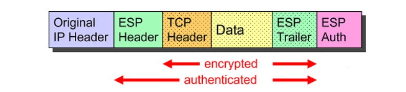

传输模式最初用于保护 IPv6 主机到主机的直接连接，目前主要用于保障第二层隧道协议（L2TP）的安全，具体可参考 RFC 3193 文档。

## 1.2. IPsec 隧道模式

在 IPsec 隧道模式下，整个 IP 数据包被 ESP 封装，并在前面添加一个外部 IP 头。

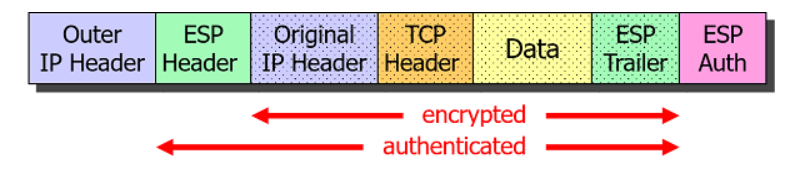

## 1.3. ESP 数据包结构

ESP 数据包由 ESP 头、加密的 IP 载荷主体以及用于填充的 ESP 尾部组成。末尾附加的认证数据字段作为加密校验和，用于保证数据完整性。

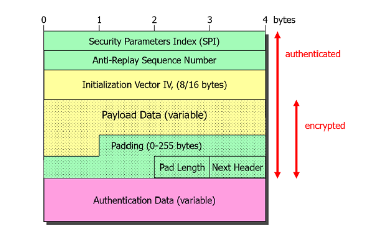

32 位的安全参数索引（SPI）供接收端 IPsec 对等体作为其内核数据库的索引，用于查找解密和认证 ESP 数据包所需的会话密钥。SPI 还用于确定解密后入站明文 IP 数据包需执行的 IPsec 安全策略。

# 2. 互联网密钥交换协议版本2 (IKEv2)

RFC 7296 中定义的互联网密钥交换协议版本 2（IKEv2）负责 IPsec 连接的建立与管理。该辅助协议使用 UDP 数据报，源端口和目的端口均设为知名 UDP 端口 500。

## 2.1. IKE_SA_INIT 请求 / 响应

发起方通过发送 IKE_SA_INIT 请求启动协商，响应方则以 IKE_SA_INIT 响应进行回复。

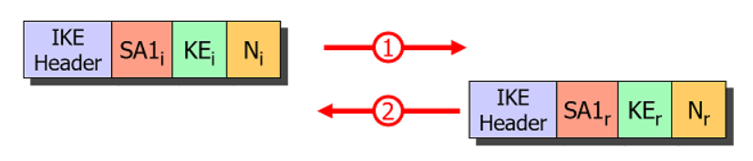

若响应方判定自身正遭受拒绝服务（DoS）攻击，可在发送计算开销较大的密钥交换（KE）载荷前，向发起方请求一个 Cookie。这一机制能有效防范 IP 欺骗攻击。

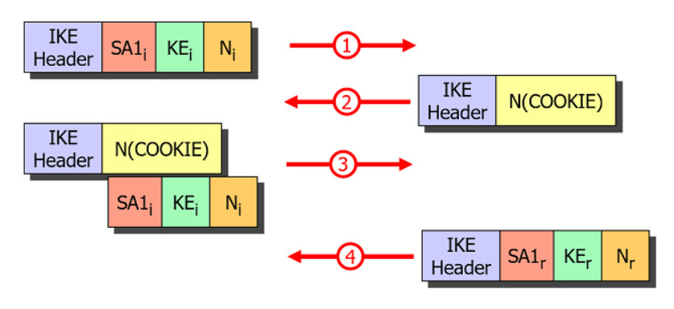

基于 IKE_SA_INIT 中密钥交换（KE）和随机数（N）载荷的交换，两端可生成共享密钥。借助通过 SA1i 和 SA1r 安全关联载荷建立的 IKE_SA，该共享密钥可对后续所有 IKE 消息进行加密。

## 2.2. IKE_AUTH 请求 / 响应

### 2.2.1. 基于证书的认证

在 IKE_AUTH 请求中，发起方通过发送身份标识 IDi、AUTHi 载荷中的数字签名（可附带证书载荷 CERTi）完成自身认证。响应方通过追溯 X.509 信任链（直至找到本地存储的根 CA 证书），验证接收的终端实体证书的有效性和可信度。

同时，发起方会发送安全关联提议 SA2i 以及一组流量选择器 TSi 和 TSr，用于建立第一个子安全关联（CHILD_SA）。

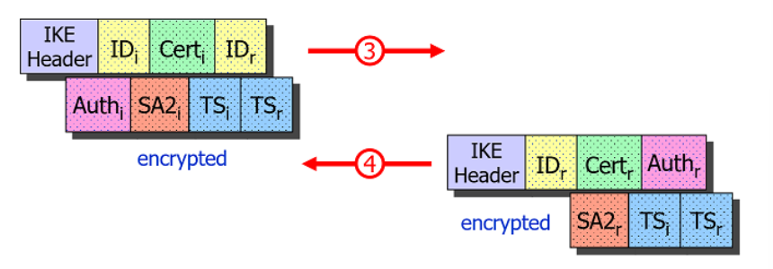

响应方则在 IKE_AUTH 响应中，通过 AUTHr 载荷中的数字签名（可附带证书载荷 CERTr）完成自身认证，并包含选定的安全关联提议 SA2r 以及可能经过缩减的流量选择器 TSi 和 TSr。基于这些信息，可安装并激活定义 IPsec 载荷数据包加密和数据完整性规则的 CHILD_SA。

### 2.2.2. 基于预共享密钥（PSK）的认证

若使用预共享密钥（PSK）进行认证，AUTHi 和 AUTHr 载荷将包含基于交换的 IKEv2 消息和预共享密钥计算的哈希值。

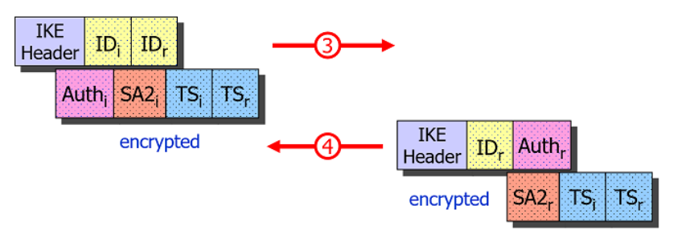

由于发起方首先在 AUTHi 载荷中发送密码哈希值，当 PSK 强度较弱且被主动中间人（MITM）截获时，攻击者可对 AUTHi 载荷实施离线字典攻击或暴力破解，存在破解密码的风险。因此，若无法确保足够的密码强度，强烈不建议使用基于 PSK 的认证方式。

### 2.2.3. 基于可扩展认证协议（EAP）的认证

为防范基于 PSK 认证可能存在的中间人攻击风险，IKEv2 标准引入了基于可扩展认证协议（EAP）的认证方式。若发起方未在 IKE_AUTH 请求中包含 AUTHi 载荷，响应方会先在 AUTHr 载荷中发送其高强度数字签名以建立信任，同时通过在 IKE_AUTH 响应中包含第一个 EAP 请求来启动 EAP 协议。

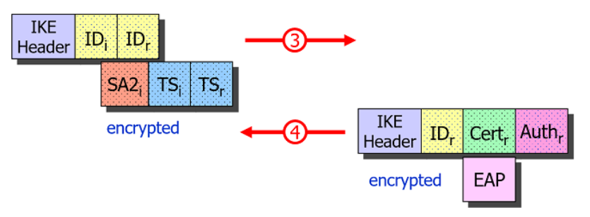

随后，发起方可通过加密的 IKEv2 通道，使用 PSK 结合 EAP-MD5 或 EAP-MSCHAPv2 协议向可信响应方完成自身认证。

## 2.3. CREATE_CHILD_SA 请求 / 响应

CREATE_CHILD_SA 请求 / 响应对用于协商额外的 CHILD_SA，或对 IKE_SA 或 CHILD_SA 进行定期密钥更新。

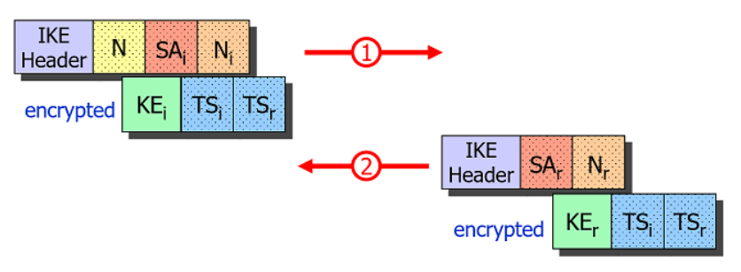

若未包含 N (REKEY_SA) 通知，则对 IKE_SA 进行密钥更新，新的密钥交换（KE）载荷可保证完美前向保密（PFS）。若包含 N (REKEY_SA) 通知，则对 CHILD_SA 进行密钥更新，此时密钥交换（KE）载荷为可选。

# 3. NAT 穿透

由于协议号为 50 的 ESP 协议本身不具备端口字段，因此它并不适用于端口地址转换（PAT）—— 这是 TCP 和 UDP 协议穿越 NAT 路由器的标准方式。

部分 NAT 路由器具备名为 “IPsec 穿透” 的功能，可检测到 NAT 设备后的单个主机发出的出站 IKE 流量，并将入站 IKE 和 ESP 数据包转发至该特定主机。

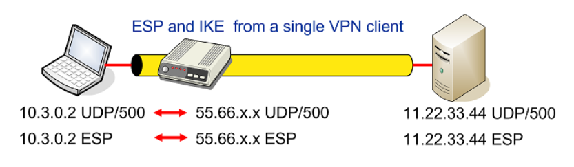

但在同一 NAT 路由器后有多个 IPsec 客户端需与同一 VPN 网关通信的场景中，此机制无法正常工作。

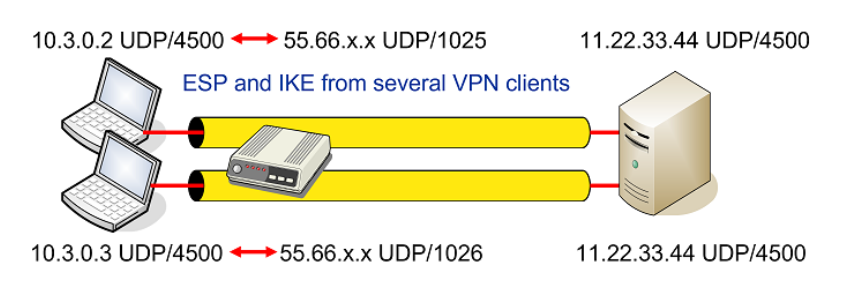

RFC 3948 提出的解决方案是将 ESP 数据包封装在 UDP 数据报中，从而支持端口地址转换。当检测到两个 IPsec 端点之间存在 NAT 环境时，NAT 穿透使用的知名 UDP 端口 4500 将与 IKE 协议共享。NAT 检测基于 IKE_SA_INIT 交换中发送的 NAT_DETECTION_SOURCE_IP 和 NAT_DETECTION_DESTINATION_IP 通知，这些通知分别包含源 IP 地址哈希和目的 IP 地址哈希。

即使不存在 NAT 环境，也可通过在 swanctl.conf 中为特定连接配置 encap = yes 强制启用 ESP-over-UDP 封装。启用后，charon 守护进程将发送经过处理的 NAT_DETECTION_SOURCE_IP 通知载荷，使远程对等体误认为存在 NAT 环境。

## 3.1. ESP-in-UDP 封装

ESP-in-UDP 封装指在 ESP 数据包的 IP 头和 ESP 头之间插入一个 8 字节的 UDP 头。初始状态下，UDP 源端口和目的端口均设为知名值 4500，但可能在传输过程中被一个或多个 NAT 路由器修改。

UDP 头之后 ESP 头的第一个字段是 32 位的非零安全参数索引（SPI）。

## 3.2. 非 ESP 标记

若 UDP 头之后的前 32 位为零，则该数据包承载的并非封装的 ESP 载荷，而是 IKE 管理数据包。因此，这 4 字节的全零非 ESP 标记用于区分 ESP 流量和 IKE 流量。ESP 数据包在 kernel 中处理，而 IKE 数据包则转发至用户空间的 charon IKE 守护进程。

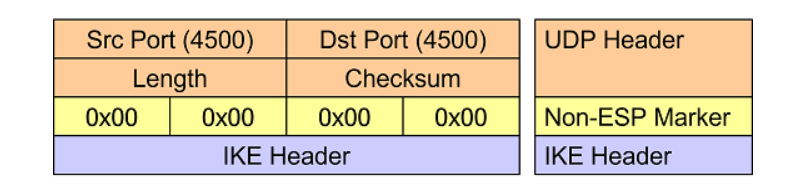

## 3.3. NAT-T 保活机制

当 NAT 路由器对出站 IP 数据包执行端口地址转换时，会将地址 / 端口映射关系与生存时间（TTL）值一同存储在内部查找表中。该映射关系是路由器将入站 IP 数据包转换回原始地址 / 端口值的必要依据。

由于已建立的 IPsec 连接可能会长达数分钟甚至数小时处于空闲状态，NAT 路由器后的 IPsec 对等体需定期发送 NAT-T 保活 UDP 数据包（仅包含一个 0xff 字节），以刷新 NAT 路由器查找表中的映射条目。

这些 NAT-T 保活数据包同样会到达连接另一端的 IPsec 对等体，但会被 kernel 静默丢弃。默认情况下，保活数据包每 20 秒发送一次，可通过 strongswan.conf 中的 charon.keep_alive 参数配置发送间隔（设为 0 可禁用保活机制，例如在静态 DNAT 即端口转发场景下）。
