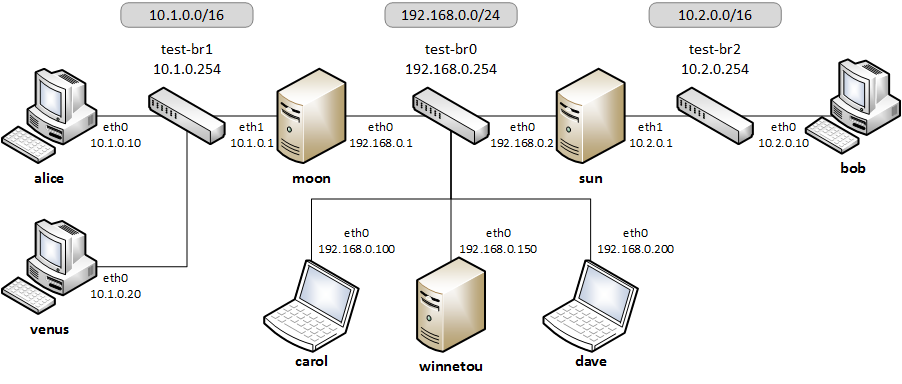
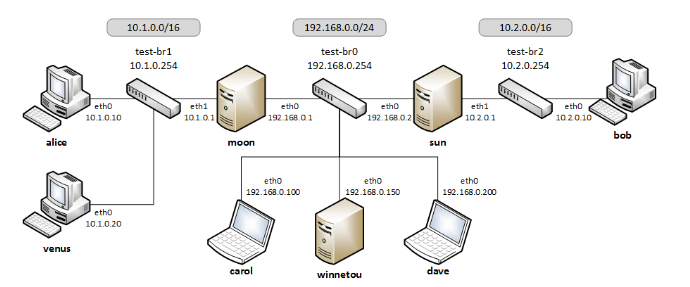

# 1. 前提条件

本文档默认读者具备以下能力：

- 理解网络基础原理，包括 IP 地址和 DNS 服务器配置，以及基础防火墙设置。
- 掌握基于公钥密码学和公钥基础设施（PKI）的基本认证概念。
- 知道如何按照说明安装二进制软件包或编译源代码。
- 熟练操作命令行。

若不具备上述知识，可使用许多现成的设备来提供远程 IPsec 访问。


# 2. 网络安全防护

StrongSwan 是一套完整的 IPsec 解决方案，可为服务器和客户端提供加密与认证功能。它可用于保护与远程网络的通信，使远程连接体验与本地连接一致。



- Gateway：

  网关通常是防火墙，也可以是网络中的任意主机。网关通常还能为小型网络提供 DHCP 和 DNS 服务。在图示中，主机 moon 和 sun 分别是内部主机 alice、venus 和 bob 的网关。

- Remote Access / Roadwarrior Clients：

  漫游客户端通常指笔记本电脑及其他移动设备，它们通过网关远程连接到家庭网络。在图示中，carol 和 dave 代表漫游客户端，它们希望访问两个网关背后的任意一个网络。

- Remote Hosts / Host-to-Host：

  远程主机可以是远程 Web 服务器或备份系统。图示中，主机 winnetou 与网关 moon、sun 中的任意一个的连接，就是该场景的示例。两台主机之间的连接通常可由任意一方发起。

- Remote Sites / Site-to-Site：

  位于不同地点的两个或多个子网中的主机，应能实现互访。再次参考图示，网关 moon 和 sun 背后的两个子网（10.1.0.0/16 和 10.2.0.0/16）可通过连接实现互访，例如主机 alice 和 bob 能安全地通信。

我们的网站提供了数十个完整的配置示例，涵盖上述及类似场景: [configuration examples](https://docs.strongswan.org/docs/5.9/config/IKEv2.html) 


# 3. IKE 和 IPSec 基础

strongSwan 本质上是一个密钥守护进程，它使用互联网密钥交换协议版本 2（IKEv2）在两个对等体之间建立安全关联（SAs）并协商安全策略（SPs）。为兼容遗留应用，仍支持 IKEv1，但鉴于稳定性和部分安全问题（该协议已正式弃用），强烈建议不要使用 IKEv1。


IKE 能对两个对等体进行强认证，并生成唯一的加密安全会话密钥。此类 IKE 会话在文档中通常表示为 IKE_SA。除认证和密钥材料外，IKE 还提供配置信息交换（如虚拟 IP 地址）和 IPsec SA 协商功能，IPsec SA 通常称为子安全关联（CHILD_SAs）。IPsec SA 定义了需保护的网络流量以及加密和认证方式。


CHILD_SA 包含两个组件：

- 实际的 IPsec SA（双向各建立一个），描述用于加密和认证流量的算法与密钥。
- 策略（至少两个），定义哪些网络流量使用该 SA。


实际的 IPsec 流量不由 strongSwan 处理，而是交由操作系统内核的网络和 IPsec 协议栈处理。strongSwan 通过平台相关的内核接口，将协商后的 IPsec SA 和 SP 安装到内核中。


策略与 SA 之间的区别常引发误解。



例如，参考上图，若主机 moon 与主机 sun 建立站点到站点隧道（连接两个网络 10.1.0.0/16 和 10.2.0.0/24），且主机 carol 与主机 sun 建立移动客户端连接（carol 获得虚拟 IP 地址 10.3.0.10），即使 sun 启用转发功能，carol 也无法自动与 alice 通信。这是因为不存在允许 carol（10.3.0.10）与 alice（10.1.0.10）之间流量通行的 IPsec 策略。解决方案之一是在 moon 和 sun 之间添加一个连接虚拟子网 10.3.0.0/24 与 10.1.0.0/16 的 SA。


通常，IPsec 处理与路由无直接关联。IPsec 通常嵌入网络协议栈，匹配的流量会被透明处理（基于策略）。因此，通往远程 TS 的任何路由在技术上都能使数据包被转发并由 IPsec 处理。但当流量从 VPN 主机本身发送时，源地址选择可能出现问题。若本地 TS 未包含其 “公网” 地址，且源地址基于默认路由选择，则流量可能无法被处理，使用虚拟 IP 地址时尤其如此。为确保从本地 TS 中选择地址作为源地址，strongSwan 的 charon IKE 守护进程默认会为大多数 CHILD_SA（如传输模式或特定端口 / 协议的 TS 除外）安装指向远程 TS 的特定路由。


另一种方案是基于路由的 IPsec，它使用接口和显式路由控制哪些数据包将通过 IPsec 隧道处理（按此路由的流量仍需匹配协商的策略）。


# 4. 认证基础

为确保建立 IKE_SA 的对等体身份真实，需对其进行认证。

strongSwan 提供多种认证方式：


## 4.1 公钥认证

使用 RSA、ECDSA 或 EdDSA X.509 证书验证对等体身份。

- 证书可自签名（需安装在所有对等体上）或由通用证书颁发机构（CA）签名。后者大幅简化部署和配置，网关只需 CA 证书即可认证所有提供该 CA 签名有效证书的对等体。
- 可使用证书吊销列表（CRLs）或在线证书状态协议（OCSP）验证证书有效性。
- 私钥可通过 pkcs11 插件存储在智能卡中，确保安全。
- 为防止中间人攻击，对等体声明的身份必须通过证书确认，可通过主体可分辨名称（subjectDn）或主体备用名称（subjectAltName）扩展验证。


## 4.2 预共享密钥认证

预共享密钥部署简单，但需使用高强度密钥才能保证安全。

- 若多个用户知晓 PSK（IKEv1 XAuth 与 PSK 结合使用时常见），任何知晓该密钥的用户都可能伪装成网关。因此，不建议在大规模部署中使用此方法。


## 4.3 可扩展认证协议

涵盖多种认证方式，部分基于用户名 / 密码（EAP-MD5、EAP-MSCHAPv2、EAP-GTC），部分基于 X.509 证书（EAP-TLS），部分可隧道传输其他 EAP 方法（EAP-TTLS、EAP-PEAP）。

- 可通过 eap-radius 插件将用户认证委托给 RADIUS 服务器。
- EAP 认证仅适用于 IKEv2，部分方法可通过 xauth-eap 插件用于 IKEv1。


## 4.4 扩展认证

XAuth 在 IKEv1 中提供灵活的认证框架，主要用于用户名 / 密码认证。它通常作为基于 X.509 证书或 PSK 双向认证后的二次认证方法。但通过 IKEv1 混合认证，可仅使用证书认证网关，使用 XAuth 认证客户端。


在 IKEv2 中，支持多轮认证（RFC 4739），例如先通过 X.509 证书认证设备，再通过用户名 / 密码方式（如 EAP-MSCHAPv2）认证用户。也可使用非对称认证，例如在第一轮认证中，通过证书认证网关，通过基于用户名 / 密码的 EAP 方法认证客户端。需注意，并非所有 IKEv2 实现都支持 RFC 4739 扩展。

我们的网站提供了数十个配置示例，涵盖上述及其他认证方式： [configuration examples](https://docs.strongswan.org/docs/5.9/config/IKEv2.html) 


# 5. 配置文件

配置 strongSwan 的推荐方式是使用功能强大的 vici 控制接口和 swanctl 命令行工具。swanctl 使用的 swanctl.conf 配置文件与证书及对应私钥一同存储在 swanctl 目录中。

全局 strongSwan 设置及插件特定配置定义在 strongswan.conf 中。

此外，也可使用遗留的 stroke 控制接口和 ipsec 命令行工具，对应已弃用的 ipsec.conf 和 ipsec.secrets 配置文件。


## 5.1. 其他配置来源

配置也可从 SQL 数据库加载，或由自定义插件提供。使用 charon-nm 守护进程变体时，可通过 NetworkManager 管理 VPN 连接。


# 6. 安装


# 7. 调用与维护


# 8. 日志与监控


# 9. PKI (公钥基础设施)


## 9.1. 证书要求


## 9.2. 证书相关说明


# 10. 路由

在 Linux 上，strongSwan 默认将路由安装到路由表 220，因此需要内核支持基于策略的路由。


可通过 strongswan.conf 中的 charon.install_routes、charon.routing_table 和 charon.routing_table_prio 设置，指定 charon 守护进程将路由安装到任意表中，或完全禁用路由安装。当两个子网之间建立隧道时，charon 会尝试在隧道化的本地子网中查找本地 IP。此类 IP 必须配置为全局作用域（scope global）才能用于查找。若找到有效 IP，charon 将安装一条指向远程子网的路由，并将源 IP 设置为找到的 IP。示例如下：

```bash
10.1.0.0/24 via 10.2.0.1 src 10.2.0.2
```

在该示例中，本地 IP 为 10.2.0.2，远程子网为 10.1.0.0/24。这样设置可确保发送到远程子网的数据包使用正确的源 IP，从而匹配 IPsec 策略，本地主机到远程子网的流量将通过 IPsec 加密保护。


为避免与这些路由冲突（尤其是使用虚拟 IP 地址时），kernel-netlink 插件会手动解析主机的路由表，以确定发送 IKE 数据包时合适的源地址。在路由数量极多的主机上，此操作效率较低。这种情况下，建议在 strongswan.conf 中设置 charon.plugins.kernel-netlink.fwmark，以使用更高效的源地址查找方式。


为检测连接变化，strongSwan 会解析内核在路由安装或删除时发送的事件，因此在动态路由接收大量路由的系统上运行时，可能导致 CPU 负载过高。可通过在 strongswan.conf 中设置 charon.process_route = no，禁用连接变化检测。


若使用 IPv6，需确保必要时绕过邻居发现协议（NDP）流量。隧道传输流量时可能遇到 MSS/MTU 问题，详情参考转发与拆分隧道文档。


# 11. 远程访问配置

本节提供常见远程访问场景的示例配置。在这些移动客户端场景中，移动设备可连接到远程网络。

由于这些客户端可能从未知 IP 地址连接，网关需设置 remote_addrs = % any，以接收来自任意地址的连接。为简化向客户端的路由流量，且由于移动客户端通常位于一个或多个 NAT 设备之后，必须使用虚拟 IP 地址。

虚拟 IP 可来自独立子网，或通过 farp 插件（可选 dhcp 插件）使用网关背后子网的 IP。

需考虑移动客户端是将所有流量发送到网关，还是使用拆分隧道（仅将特定目标的流量通过隧道传输）。详情参考转发与拆分隧道文档，该文档还解释了如何将流量转发到网关背后的主机。


## 11.1. IKEv2 配置


# 12. site-to-site 配置

我们提供以下 site-to-site 配置示例： [configuration examples](https://docs.strongswan.org/docs/5.9/config/IKEv2.html#_site_to_site)


# 13. host-to-host 配置


