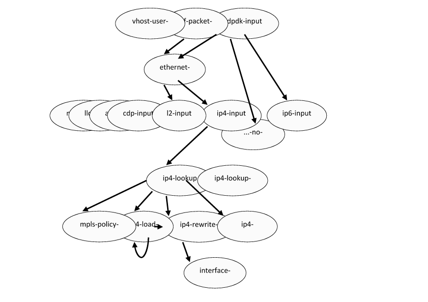
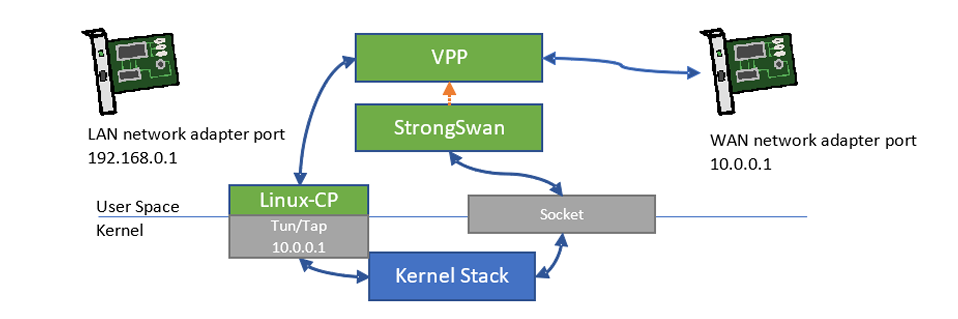
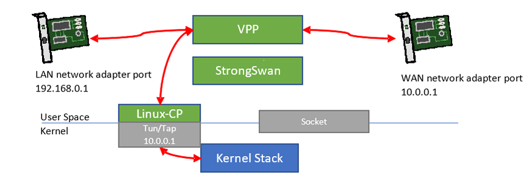
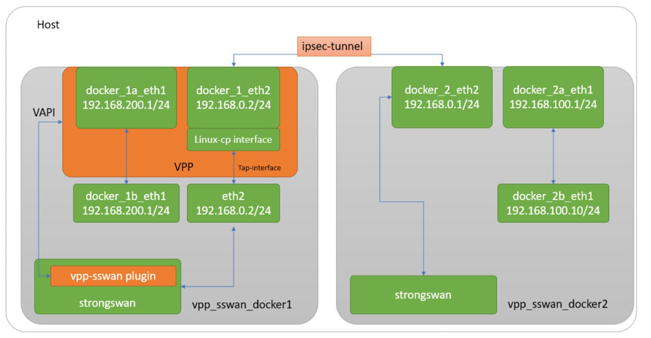
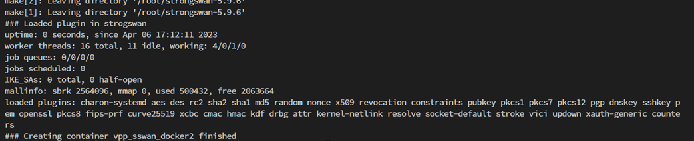

# 1. 引言

FD.io 矢量数据包处理（VPP）IPsec 是 VPP 中的重要组件，用于支持安全、可靠且高速的网络应用。VPP IPsec 提供了一套易于使用的命令行界面（CLI）和 VAPI 命令，供用户配置安全策略数据库（SPD）、安全关联（SA）以及相关的加密算法和密钥。

在单个第 3 代英特尔 ® 至强 ® 可扩展处理器内核上运行 VPP IPsec 时，采用 AES-GCM-128 加密算法的隧道模式 IPsec（IPsec IPv4 路由），单个安全关联（SA）的吞吐量可达 31 Gbps，是基于 Linux 内核的 IPsec 的 6 倍以上 ¹。对于第 4 代英特尔 ® 至强 ® 处理器，单个处理器封装中的 40 个 CPU 内核可实现高达 1.89Tb 的无丢包率（NDR）IPsec 隧道吞吐量，相当于每个 CPU 内核近 50 Gbps²。凭借如此高的吞吐量优势，从内核 IPsec 切换到 FD.io VPP IPsec 显然是一个理想方案，但这也带来了需要解决的新问题。IPsec 依赖安全的方法在两个端点之间建立 SA，处理 SA 建立的协议是互联网密钥交换（IKE）。FD.io VPP IPsec 拥有成熟、高性能且广泛使用的 IPsec 实现，但它的 IKEv2 实现并不完整，尚未达到生产就绪状态。

StrongSwan 是最广泛使用的 IKE 应用之一，是一个多平台 IPsec 实现。StrongSwan 具备完整的 IKE 套件，其插件架构支持将 IPsec 数据平面处理移交至内部或第三方实现（如 Linux/Windows 内核等），这为 VPP IPsec 与 StrongSwan 的集成提供了可能。

本指南将展示如何使用 VPP 中的两个新插件 ——VPP-SSwan 和 Linux 控制平面（Linux-CP），实现 VPP 与 StrongSwan 的无缝集成，从而让用户能够替换 StrongSwan 的 Linux 内核 IPsec 数据路径，借助 VPP 显著提升 IPsec 性能。

本文档面向通信服务提供商或任何希望提升其网络中 IPsec 吞吐量性能的用户。尽管本文档的核心目标是展示 StrongSwan 与 VPP IPsec 的集成，但其中涉及的技术也可作为 VPP 与其他 IKEv2 控制平面接口集成的参考。

本文档属于网络与边缘平台系列。


# 2. 概述

本文档旨在提供一份指南，展示如何将 StrongSwan 与 FD.io VPP 集成，让用户既能受益于 StrongSwan 友好的界面，又能获得 VPP IPsec 的高性能。

本文档包含分步指南，涵盖 VPP 和 StrongSwan 的 VPP-SSwan 插件的编译、安装，以及在两个容器之间执行基本测试（包括 IKEv2 握手、SA 协商和容器间 ping 测试）—— 其中一个容器运行 StrongSwan + Linux 内核 IPsec，另一个运行 StrongSwan + VPP IPsec。


## 2.1 Linux 内核 IPsec 实现

Linux 内核 IPsec 是目前使用最广泛的 IPsec 解决方案之一，以支持丰富的算法、持续维护且基本无漏洞而闻名。然而，Linux 内核 IPsec 的性能并非最优：单个 CPU 内核在单个 SA IPsec 场景下的吞吐量不超过 5 Gbps³。

英特尔 ®IPsec 多缓冲区加密是一系列高度优化的对称加密算法软件实现。借助英特尔 ®IPsec 多缓冲区加密提供的丰富且易用的 API，用户可以充分利用 CPU 最新的加密加速功能（包括新的 vAES 和 vPCLMUL 指令）。这些英特尔 ® 高级矢量扩展 512（Intel® AVX-512）加速指令支持并行处理多达 4 个 128 位 AES 块，理论性能是第 3 代英特尔 ® 至强 ® 可扩展处理器的 4 倍。此外，英特尔 ® 多缓冲区加密库通过 API 隐藏了所有实现细节，以适配不同的 CPU 标志（SSE、AVX、AVX2、AVX512），确保为市场上所有英特尔 ®CPU 提供高度优化的加密运算结果，并支持用户代码无缝迁移至基于第 3 代和第 4 代英特尔 ® 至强 ® 可扩展处理器的新系统。


## 2.2 VPP IPSec 内核旁路由实现


### 2.2.1 快速数据输入/输出 与 矢量数据包处理

FD.io（快速数据输入 / 输出）是一个 Linux 基金会开源项目，提供高速网络数据包处理能力。FD.io 矢量数据包处理（VPP）是 FD.io 旗下的子项目之一，提供 L2-L4 栈处理功能。

VPP 中的 “矢量” 本质上是一组数据包，称为 “数据包矢量”。每个功能块将数据包矢量（当前最大支持 256 个数据包）作为输入，并以相同方式处理它们，这有助于最大化 CPU 指令缓存（I-cache）的效率。此外，VPP 创新性地采用数据包处理图作为核心设计，每个功能块被抽象为一个图节点。通过在初始化时或运行时注册 “下一个” 输出节点，图节点被组织成树形结构。数据包矢量将根据每个节点的目标处理节点，从网络适配器的接收（RX）节点一直流转到发送（TX）节点（或被丢弃）。



数据包处理图具有高度灵活的显著优势：新的图节点可以在任何位置 “插入”，现有节点可以通过简单的软件配置或实时命令行配置被旁路。同时，其 “运行至完成” 模型确保数据包矢量在整个处理流水线中始终位于 CPU 数据缓存内，因此效率极高。

有关 VPP 的更多信息，请参考本文档参考资料部分提供的链接。


### 2.2.2 VPP IPSec

VPP IPsec 是 VPP 中面向安全、可靠且高速网络应用的重要组件。VPP IPsec 提供了一套易于使用的 CLI 和 VAPI 命令，供用户配置安全策略数据库、安全关联以及相关的加密算法和密钥。有关完整的加密功能支持，请参考 VPP IPsec 维基页面。

IPsec 中最消耗资源的过程是对称加密运算。为确保加密运算的性能和灵活性，VPP IPsec 充分利用了底层的加密基础设施。

在单个第 4 代英特尔 ® 至强 ® 可扩展处理器内核上运行 VPP IPsec 时，采用 AES-GCM-128 算法的隧道模式 IPsec，单个 SA 的吞吐量可达 50 Gbps，是 Linux 内核 IPsec 的 6 倍以上。搭载相同处理器的计算机系统，使用 40 个 CPU 内核可实现高达 1.89Tb 的无丢包率 IPsec 隧道吞吐量。


## 2.3 IKEv 与 strongswan

凭借如此高的吞吐量优势，从内核 IPsec 切换到 FD.io VPP IPsec 似乎是必然选择，但实际实现更为复杂。IPsec 依赖安全的方法在两个端点之间建立 SA，处理 SA 建立的协议是互联网密钥交换（IKE）。IKE 用于在端点之间建立共享会话密钥，该密钥将用于安全派生对称加密密钥。IKE 目前的版本为第 2 版（IKEv2），与早期版本相比，IKEv2 具有支持 NAT 穿越、SCTP、抗 DoS 攻击等更多优势。FD.io VPP IPsec 拥有成熟、高性能且广泛使用的 IPsec 实现，但它的 IKEv2 实现并不完整，尚未达到生产就绪状态。为了让 VPP IPsec 得到广泛采用，我们需要一个替代的 IKEv2 后端；而将流行的 IKE 应用与 VPP 集成，也有助于简化用户向 VPP IPsec 解决方案的迁移。

StrongSwan⁴ 是最广泛使用的 IKE 应用之一，其具备完整的 IKE 套件，插件架构支持将 IPsec 数据平面处理移交至内部或第三方实现（如 Linux/Windows 内核等），这为 VPP IPsec 与 StrongSwan 的集成提供了可能。


# 3. Our Solution：搭载 Linux 控制平面的 vpp-sswan


## 3.1 vpp-sswan

VPP-SSwan 是一个 StrongSwan 插件，用于将 IPsec 出站和入站数据平面数据包处理卸载到 FD.io VPP。该插件利用 VPP C API⁶，将 IPsec SA 的添加 / 删除请求和路由规则转换为 VPP 套接字消息。VPP-SSwan 具有以下优势：

1. 易于使用：VPP-SSwan 遵循 StrongSwan Charon 规范编写，并提供实用脚本用于编译和安装插件。若 StrongSwan 已安装在系统的自定义位置，用户只需运行单个命令，或手动将编译后的 VPP-SSwan 插件和配置文件复制到特定的 StrongSwan 目录，然后重启 StrongSwan 服务即可。
2. 高性能：VPP-SSwan 充分利用了高度优化的 VPP I/O 和 IPsec 栈，网络 I/O 和 IPsec 数据路径均由 VPP 处理。

VPP-SSwan 插件自 VPP 22.10 版本起被纳入 VPP 主流版本，支持 StrongSwan 5.9.5 及以上版本。

VPP-SSwan 要求 VPP 接管网络 I/O，而 StrongSwan 要求控制路径（IKE）数据包和数据路径（ESP）数据包使用相同的 IP 地址。VPP 提供了一种将入站 IKE 数据包路由到 Linux 内核栈、将出站 IKE 数据包路由到受保护网络适配器的方式，且最好无需为它们单独配置路由。这正是 VPP Linux 控制平面（Linux-CP）插件的用武之地。


## 3.2 linux 控制平面插件

Linux 控制平面（Linux-CP）是一个 VPP 插件，允许 VPP 与 Linux 内核集成。Linux-CP 的核心思想是在 VPP 所属的网络适配器和 VPP 与 Linux 内核之间的 Tun/Tap 接口之间提供一对镜像接口，网络流量在 Linux Tun/Tap 接口和配对的 VPP 网络适配器之间交叉连接。

Linux-CP 会配置 Tun/Tap 接口与网络适配器之间的路由，并自动同步 VPP 和 Linux 之间的 ARP/ND 表。当通过 VPP 为网络适配器分配 IP 地址时，Linux-CP 会捕获该命令，并在 Linux 内核侧自动为 Tun/Tap 接口配置相同的 IP 地址，确保带有对应 IP 地址的数据包在 VPP 内部的网络适配器和 Tun/Tap 接口之间路由。此外，Linux-CP 确保 ARP/ND 邻居表归 Linux 内核所有，同时将条目复制到 VPP。


## 3.3 vpp-sswan 与 Linux-cp 的协同工作原理



上图展示了在 Linux-CP 的帮助下，IKE 消息如何在 VPP 所属的网络适配器和 StrongSwan 之间流转。

在该示例中，假设 StrongSwan 期望 IKE 消息和加密的 ESP 数据包使用的本地 IP 地址为 10.0.0.1。要将 VPP 所属网络适配器的 IKE 数据包路由到 StrongSwan，需创建一个 Linux-CP 实例，绑定镜像接口对（图中的 WAN 网络适配器端口和 Tun/Tap 端口），两者均配置相同的 IP 地址 10.0.0.1。Linux-CP 会自动配置接口之间的路由。当 VPP 通过 WAN 网络适配器端口接收 IKE 消息后，会通过 Tun/Tap 端口将其路由到内核，经 Linux 内核栈处理后传递给 StrongSwan。若 SA 协商成功，StrongSwan 会通过 VPP-SSwan 插件在 VPP 中配置 IPsec ESP 流和路由。自动配置完成后，VPP 将负责 IPsec ESP 的加密 / 解密以及将数据包转发到目标端口。

假设两个子网（192.168.0.0/24 和 192.168.1.0/24）通过互联网连接，希望建立安全的 IPsec 隧道。每个子网都有一个 IPsec 网关系统，其 WAN IP 分别为 10.0.0.1 和 10.0.0.2。每个网关系统上的 StrongSwan 应用协商共同的 SA，并私下创建会话对称加密算法和密钥。将数据平面处理卸载到 VPP 的 StrongSwan 应用，会通过 VPP 的 C API 创建安全策略（SP）和 SA。VPP-SSwan 确保 SA/SP 的创建请求被正确解析为 VPP C API 调用，而 Linux-CP 则处理 WAN 网络适配器和镜像 Tun/Tap 端口之间的正确路由配置。



从此时起，由于 VPP 同时接管了 LAN 和 WAN 网络适配器，它将接收来自这两个适配器的数据包，并相应地处理路由和 IPsec 出站 / 入站操作。当 LAN 网络适配器接收的数据包匹配出站安全策略（SP）规则时，会对其进行加密（包括添加 ESP 头部），加密后的数据包将被转发到 WAN 网络适配器端口。

另一方面，当 WAN 网络适配器接收数据包时，会检查是否匹配适用的入站 SP 规则。若匹配，将对数据包进行解密并移除 ESP 头部或隧道头部，然后根据解密数据包中的 IP 目标地址，将其转发到 LAN 网络适配器或 Tun/Tap 端口。VPP-SSwan 还会确保 IPsec 旁路 / 丢弃规则得到相应处理。


## 3.5 如何使用 vpp-sswan 与 linux-cp 集成 vpp 与 strongswan

自 VPP 22.10 版本起，VPP-SSwan 已集成到主流 VPP 中，其路径为 vpp/extras/strongswan/vpp_sswan。该解决方案提供了一些便捷的自动化脚本，帮助轻松编译和安装插件。


### 3.5.1 下载并编译 vpp

要开始 VPP 开发，需获取所需的 VPP 源代码并构建软件包。有关 VPP 构建指南和系统先决条件，请参考 VPP 入门指南：https://s3-docs.fd.io/vpp/23.02/gettingstarted/installing/index.html


### 3.5.2 构建 vpp-sswan 插件

VPP-SSwan 编译需要 StrongSwan 源代码，执行以下命令构建 VPP-SSwan：

```bash
cd <VPP directory>/extras/strongswan/vpp_sswan/ 
make all
```


### 3.5.3 安装 strongswan 5.9.5 或更高版本 （可选）

建议使用 VPP-SSwan 支持的 StrongSwan 5.9.6 或 5.9.5 版本进行编译和集成：

1. 下载 StrongSwan 源代码至以下目录：

```plaintext
cd <vpp directory>/build/external/downloads

wget https://github.com/strongswan/strongswan/archive/refs/tags/5.9.5.zip
```


2. 将 StrongSwan 源代码解压至：

```
<vpp directory> /build-root/build-vpp-native/external/sswan 
```


3. 执行以下命令配置 strongswan：

```plaintext
cd <vpp directory> /build-root/build-vpp-native/external/sswan/strongswan-5.9.5 

./autogen.sh 

./configure --prefix=/usr --sysconfdir=/etc --enable-libipsec --enable-systemd --enable-swanctl -
disable-gmp --enable-openssl 

make 

make install
```


或者，也可以在 vpp-sswan 目录中下载 StrongSwan 源代码压缩包并执行安装：

```plaintext
cd <VPP directory>/extras/strongswan/vpp_sswan/ 
make pull-swan 
make install-swan
```


### 3.5.4 将 vpp-sswan 插件安装到 strongswan

构建 VPP-SSwan 插件并在主机上安装 StrongSwan 后，执行以下命令将 VPP-SSwan 插件安装到 StrongSwan：

```bash
cd <VPP directory>/extras/strongswan/vpp_sswan/ 
make install
```


或者，也可以手动将 libstrongswan-kernel-vpp.so 复制到 /usr/lib/ipsec/plugins 目录，并将 kernel-vpp.conf 复制到 /etc/strongswan.d/charon/ 目录。


需重启 StrongSwan 服务以应用新更改：

```bash
systemctl restart strongswan.service
```


### 3.5.5 重启 strongswan

示例配置文件 swanctl.conf 提供了初始化两个端点之间连接的示例配置，可根据需求更新该文件并复制到：/etc/swanctl/conf.d/swanctl.conf


## 3.6 构建 vpp-sswan docker 镜像

自 VPP 22.10 版本起，VPP-SSwan Docker 测试脚本提供了集成测试环境，支持创建 Docker 镜像、启动 VPP、配置网络接口和部署 StrongSwan 配置。测试脚本包含一个运行脚本，可构建两个容器镜像（已安装 VPP、DPDK 和 StrongSwan），这些预定义镜像使用 swanctl.conf 配置文件在两个容器之间建立安全关联（SA）。




### 3.6.1 创建并准备容器

run.sh 脚本将自动下载 VPP 和 DPDK 源代码，编译并安装到 Docker 镜像中：

```bash
sudo ./extras/strongswan/vpp_sswan/docker/run.sh prepare_containers 
```




### 3.6.2 在 docker 容器中应用 vpp-sswan 配置


