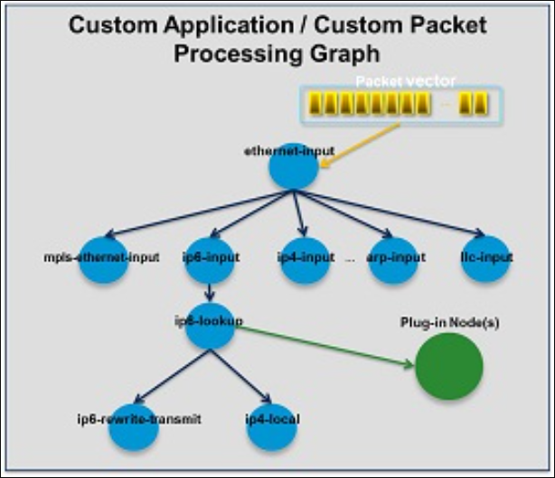
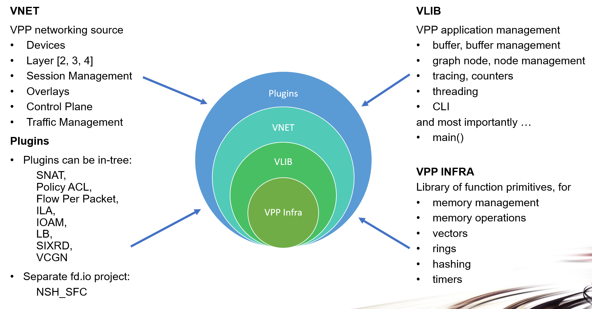

FD.io 的矢量数据包处理器（Vector Packet Processor，简称 VPP）是一款高速、可扩展的 2-4 层多平台网络协议栈。它可在 Linux 用户空间运行，支持 x86、ARM 和 Power 等多种架构。

VPP 的高性能网络协议栈正迅速成为全球各类应用的首选网络协议栈。

通过广泛使用插件，VPP 的功能不断得到增强。数据平面开发工具包（Data Plane Development Kit，简称 DPDK）就是典型示例，它为 VPP 提供了一些重要功能和驱动程序。

VPP 支持与 OpenStack 和 Kubernetes 集成。其网络管理功能包括配置、计数器、采样等。对于开发人员，VPP 提供了高性能事件日志记录和多种数据包跟踪功能；开发调试镜像则包含完整的符号表以及全面的一致性检查功能。

VPP 的部分用例包括虚拟交换机（vSwitch）、虚拟路由器（vRouter）、网关、防火墙和负载均衡器等，仅举几例。


# 1. 什么是VPP


## 1.1. 标量 vs 矢量数据包处理

FD.io VPP 采用矢量数据包处理技术开发，而非标量数据包处理。

矢量数据包处理是高性能数据包处理应用（如 FD.io VPP 和 DPDK）中常用的方法。而基于标量的处理方式则更受那些对性能没有严格要求的网络协议栈青睐。


### 1.1.1. 标量数据包处理

标量数据包处理的网络协议栈通常一次处理一个数据包：中断处理函数从网络接口取出单个数据包，然后通过一系列函数对其进行处理 ——fooA 调用 fooB，fooB 再调用 fooC，依此类推。

```shell
+---> fooA(packet1) +---> fooB(packet1) +---> fooC(packet1)
+---> fooA(packet2) +---> fooB(packet2) +---> fooC(packet2)
...
+---> fooA(packet3) +---> fooB(packet3) +---> fooC(packet3)
```

标量数据包处理虽然简单，但在以下方面存在低效问题：

当代码路径长度超过微处理器指令缓存（I-cache）的大小时，会发生抖动 —— 因为微处理器需要不断加载新指令。在这种模式下，每个数据包都会产生相同的指令缓存未命中问题。

> 一个复杂程序的代码路径可能包含大量指令（如大型循环、多分支逻辑或频繁调用的复杂函数），当程序所需存储的指令总量超过 I-cache 的容量时，I-cache 无法一次性容纳所有必要的指令。此时，CPU 在执行过程中会频繁遇到 缓存未命中 的情况，导致 I-cache 不断置换指令，形成抖动，程序实际执行速度可能比预期慢数倍。

相关的深层调用栈还会增加加载 - 存储单元的压力，因为栈局部变量会从微处理器的一级数据缓存（D-cache）中溢出。


### 1.1.2. 矢量数据包处理

相比之下，矢量数据包处理的网络协议栈一次处理多个数据包，这些数据包被称为 “数据包向量”（vectors of packets）或简称为 “向量”（vector）。

中断处理函数从网络接口获取数据包向量，然后通过一系列函数对该向量进行处理 ——fooA 调用 fooB，fooB 再调用 fooC，依此类推。

```shell
+---> fooA([packet1, +---> fooB([packet1, +---> fooC([packet1, +--->
            packet2,             packet2,             packet2,
            ...                  ...                  ...
            packet256])          packet256])          packet256])
```

这种方法解决了以下问题：

通过在多个数据包间分摊指令缓存加载的成本，解决了上述指令缓存抖动问题。

通过从网络接口一次接收最多 256 个数据包的向量，并使用节点有向图对其进行处理，解决了深层调用栈带来的低效问题。图调度器每次调用一个节点调度函数，将栈深度限制在几个栈帧以内。

这种方法还能实现进一步优化，例如通过流水线和预取技术，最小化表数据的读取延迟，并并行化处理数据包所需的数据包加载操作。


## 1.2. 数据报处理图

FD.io VPP 设计的核心是数据包处理图，这一设计使该软件具备以下特性：

- 可插件化、易于理解且便于扩展
- 成熟的图节点架构
- 可完全控制流水线的重组
- 性能高效，插件享有同等地位

FD.io VPP 的数据包处理流水线被分解为一个 “数据包处理图”。这种模块化方法意味着，任何人都可以 “插入” 新的图节点 —— 这不仅让 VPP 的扩展性大幅提升，还能针对特定用途定制插件。此外，VPP 还可通过其底层 API 进行配置。



在运行时，FD.io VPP 平台会从 RX rings 组装数据包向量，单个向量中通常最多包含 256 个数据包。随后，数据包处理图会逐节点（包括插件）应用于整个数据包向量：当每个图节点所代表的网络处理操作依次作用于向量中的每个数据包时，接收的数据包会在向量中遍历数据包处理图的各个节点。

图节点本身具有 “体积小巧、模块化、低耦合” 的特点，这使得引入新图节点、重新连接现有图节点的操作变得十分简便。

插件本质是共享库（动态库），由 VPP 在运行时加载。VPP 的插件加载逻辑如下：通过搜索插件路径查找库文件，然后在启动时依次动态加载每个插件。一个插件可实现两种核心功能：一是引入新的图节点，二是重新编排数据包处理图的结构。

更灵活的是，可以完全独立于 FD.io VPP 源代码构建插件——这意味着插件可被视为一个完全独立的组件，无需依赖 VPP 核心代码即可开发和维护。


## 1.3. 网络栈特性

- L2 - 4 层网络栈
  - 用于路由、网桥条目的快速查找表
  - 任意 n 元组分类器
  - 控制平面、流量管理和叠加网络
- Linux 和 FreeBSD 系统支持
  - 支持标准操作系统接口，如 AF_Packet、Tun/Tap 和 Netmap
- 借助 DPDK 支持网络和加密硬件
- 支持容器和虚拟化技术
  - 半虚拟化接口：Vhost 和 Virtio
  - 通过 PCI 透传的网络适配器
  - 原生容器接口：MemIF
- 主机栈
- 通用数据平面：一个代码，适用于多种用例
  - 独立设备（如路由器和交换机）
  - 云基础设施和虚拟网络功能
  - 云原生基础设施
  - 所有用例使用相同的二进制包
- 得益于 CSIT（持续系统集成测试），开箱即具备生产级质量


## 1.4. 主机栈

VPP 的主机栈利用 VPP 基于图的转发模型和矢量化数据包处理技术，确保高吞吐量并扩展传输协议终结能力。它提供的 API 不仅支持用户空间应用高效地消费和生成数据，还能实现高效的本地应用间通信。

从高层来看，VPP 的主机栈包含三个主要组件：

- 会话层：用于促进传输协议与应用程序之间的交互
- 可插拔的传输协议：包括 TCP、QUIC、TLS、UDP
- VCL（VPP 通信库）：一套旨在从应用程序角度简化该栈使用的库


所有这些组件都是定制构建的，以适应 VPP 的架构并充分利用其速度优势。为此，开发团队投入了大量精力：

- 构建了支持传输协议可插拔的会话层，该层通过定制的共享内存基础设施，抽象了应用程序与传输协议之间的交互。值得注意的是，这也使得通常在应用程序中实现的传输协议（如 QUIC 和 TLS）能够在 VPP 内部实现。
- 开发了全新的 TCP 实现，支持矢量化数据包处理，并遵循 VPP 的高可扩展线程模型。该实现符合 RFC 标准，支持大量高速 TCP 协议特性，并已通过 Defensic 的 Codenomicon 超过 100 万项测试用例的验证。
- 开发了 VCL 库，它在用户空间模拟传统的异步通信函数，同时允许在需要时开发新的通信模式。
- 实现了高性能的 “直通” 通信模式，使连接到 VPP 的应用程序能够通过共享内存透明地交换数据，而不会产生传统传输协议的额外开销。测试表明，这比传统的容器间网络高效得多。


## 1.5. 额外特性

- 丰富的运行时计数器：可统计吞吐量、每周期指令数、错误数、事件数等指标
- 集成式流水线跟踪工具
- 多语言 API 绑定
- 用于调试的集成式命令行
- 容错性与可升级性
  - 它作为标准的用户空间进程运行以实现容错性，软件崩溃通常只需重启进程即可解决。
  - 与在内核中运行类似数据包处理任务相比，其容错性和可升级性更优：软件更新完全无需重启系统。
  - 开发体验更优：相较于编写类似的内核代码，VPP 的开发难度更低
  - 硬件隔离与保护（输入输出内存管理单元，iommu）
- 为安全性设计
  - 全面的白盒测试
  - 镜像段基地址随机化
  - 共享内存段基地址随机化
  - 栈边界检查
  - 基于 Coverity 工具的静态分析


## 1.6. 支持的架构和操作系统

以下是 VPP 支持的架构与操作系统：


### 1.6.1. 架构

FD.io VPP 平台支持以下架构：

- x86/64 
- ARM-AArch64


### 1.6.2. 操作系统与软件包安装

FD.io VPP 支持在以下最新的长期支持（LTS）版本上通过软件包进行安装：

- Debian
- Ubuntu


## 1.7. 性能

FD.io VPP 的优势之一是其在相对低功耗计算设备上的高性能。其性能优势体现在以下方面：

- 专为通用硬件设计的高性能用户空间网络栈：
  - 支持 L2、L3、L4 层功能及封装。

- 经过优化的数据包接口，可支持多种使用场景：
  - 集成 vhost-user 后端，实现虚拟机间（VM-to-VM）高速连接
  - 集成 memif 容器后端，实现容器间（Container-to-Container）高速连接
  - 集成基于 vhost 的接口，用于将数据包转发至 Linux 内核

- 相同的优化代码路径可在主机、虚拟机（VM）和 Linux 容器内部运行。
- 充分利用一流的开源驱动技术：DPDK（数据平面开发工具包）。
- 经过大规模测试验证：支持线性核心扩展，已在数百万条流和 MAC 地址的场景下完成测试。


这些特性的设计充分利用了常见的微处理器优化技术，例如：

- 通过向量方式处理数据包，减少缓存和 TLS（线程本地存储）缺失
- 借助 SSE、AVX 和 NEON 等向量指令提升 IPC（每周期指令数）
- 消除模式切换、上下文切换和阻塞，确保始终执行有效工作
- 采用缓存行对齐的缓冲区，提高缓存和内存效率


### 1.7.1. CSIT

连续系统集成与测试（CSIT）项目为 FD.io VPP 提供功能和性能测试，重点关注功能和性能回归问题。测试结果发布在 [《CSIT测试报告》](https://docs.fd.io/csit/master/report/) 中。


### 1.7.2. 数据包吞吐量示例

以下是几个 CSIT 测试报告的示例链接。测试标题格式如下：

```shell
<packet size>-<number of threads><number of cores>-<test>-<interface type>

<数据包大小>-< 线程数 >< 核心数 >-< 测试类型 >-< 接口类型 >
```

例如，标题为 “64b-2t1c-l2switching-base-i40e” 的测试表示：使用 64 字节数据包，2 个线程，1 个核心，基于 i40e 接口进行 L2 交换测试。


### 1.7.3. 吞吐量趋势图表

以下是 CSIT 趋势仪表板中的部分数据包吞吐量趋势图表。请注意，趋势图表中的性能数据会随软件开发周期每晚更新：

- [以太网交换趋势](https://docs.fd.io/csit/master/trending/trending/l2.html)

- [IPv4 路由趋势](https://docs.fd.io/csit/master/trending/trending/ip4.html)
- [IPv6 路由趋势](https://docs.fd.io/csit/master/trending/trending/ip6.html)


# 2. 使用案例


## 2.1. vpp 与 容器

本节将涵盖如何通过 VPP（矢量数据包处理）连接两个 Linux 容器。容器本质上是一种更高效、更快速的虚拟机，其原因在于容器无需模拟独立的内核和硬件。你可以点击此处了解有关 Linux 容器的更多相关内容。

本节内容已在 Ubuntu 22.04 LTS（长期支持版）环境下测试通过。


### 2.1.1. 创建容器

确保你已经在想要创建容器的系统上完成了 VPP 的下载和安装。VPP 安装完成后，通过以下命令安装容器相关的软件包（如 lxc）：

```bash
sudo apt-get install bridge-utils lxc
```


正如 lxc.conf 手册页中所述：“容器配置存储在容器目录下的配置文件中。创建容器时，会生成一个基础配置，其中包含所选模板推荐的默认值以及来自 default.conf 文件的额外默认键值。”

“该 default.conf 文件要么位于`/etc/lxc/default.conf`，对于非特权容器，要么位于`~/.config/lxc/default.conf`。”


由于我们希望在两个容器之间进行 ping 测试，因此需要向该文件添加内容。查看 default.conf 的内容，初始内容应如下所示：

```bash
cat /etc/lxc/default.conf

lxc.net.0.type = veth
lxc.net.0.link = lxcbr0
lxc.net.0.flags = up
lxc.net.0.hwaddr = 00:16:3e:xx:xx:xx
```


如你所见，默认情况下有一个 veth 接口。

现在你需要向该文件追加内容，以便你创建的每个容器都有一个用于 Linux 网桥的接口和一个未使用的第二个接口。

你可以通过将 echo 的输出通过管道传递给 tee 来实现，如下所示，每行用换行符`\n`分隔。或者，你可以使用 vi 等文本编辑器手动向该文件添加内容，但要确保拥有 root 权限。

```bash
echo -e "lxc.net.0.name = veth0\nlxc.net.1.type = veth\nlxc.net.1.name = veth_link1"  | sudo tee -a /etc/lxc/default.conf
```


再次检查内容以确认文件确实已修改：

```bash
cat /etc/lxc/default.conf

lxc.net.0.type = veth
lxc.net.0.link = lxcbr0
lxc.net.0.flags = up
lxc.net.0.hwaddr = 00:16:3e:xx:xx:xx
lxc.net.0.name = veth0
lxc.net.1.type = veth
lxc.net.1.name = veth_link
```

完成上述操作后，我们就可以创建容器了。


- 创建一个名为 “cone” 的 Ubuntu Focal 容器：

```bash
lxc-create -t download -n cone -- --dist ubuntu --release focal --arch amd64
```

如果成功，你将得到类似如下的输出：

```bash
You just created an Ubuntu focal amd64 (20231027_07:42) container.

To enable SSH, run: apt install openssh-server
No default root or user password are set by LXC.
```


- 再创建一个容器 “ctwo”：

```bash
lxc-create -t download -n ctwo -- --dist ubuntu --release focal --arch amd64
```


- 列出你的容器以确认它们已存在：

```bash
lxc-ls

cone ctwo
```


- 启动第一个容器

```bash
lxc-start --name cone
```

并确认它正在运行：

```bash
lxc-ls --fancy

NAME  STATE   AUTOSTART  GROUPS  IPV4  IPV6  UNPRIVILEGED
cone  RUNNING 0          -       -     -     false
ctwo  STOPPED 0          -       -     -     false
```


### 2.1.2. 容器软件包


### 2.1.3. 连接两个容器


## 2.8. vpp 生成流量

VPP 包含一个功能相当强大的网络模拟器插件，它可以模拟真实世界的往返时间和可配置的网络丢包率。这非常适合在特定的延迟 / 带宽 / 丢包条件下评估 TCP 协议栈的性能。

“nsim” 插件在二层交叉连接两个物理接口，并引入指定的延迟和网络丢包参数。动态重新配置是可行的，但前提是网络模拟器调度轮中缓存的数据包将会丢失。


### 2.8.1. 配置

通过调试 CLI 进行配置很简单。首先，指定模拟器配置：单向延迟（所需 RTT 的一半）、链路带宽和预期的平均数据包大小。这些参数使网络模拟器能够分配适当的缓冲区大小，以实现所需的延迟 / 带宽乘积。

```bash
set nsim delay 25.0 ms bandwidth 10 gbit packet-size 128
```


要模拟网络丢包，可添加 “packets-per-drop（每丢包数）” 或 “drop-fraction [0.0…1.0]（丢包率 [0.0…1.0]）” 参数：

```bash
set nsim delay 25.0 ms bandwidth 10 gbit packet-size 128 packets-per-drop 10000
```


记得配置二层交叉连接：

```bash
nsim enable-disable <接口1> <接口2>
```


### 2.8.2. 数据包生成配置

以下是 VPP 数据包生成器的单元测试配置：

```bash
loop cre  # 创建环回接口
set int ip address loop0 11.22.33.1/24  # 设置loop0接口的IP地址为11.22.33.1/24
set int state loop0 up  # 设置loop0接口为启动状态

loop cre  # 创建环回接口
set int ip address loop1 11.22.34.1/24  # 设置loop1接口的IP地址为11.22.34.1/24
set int state loop1 up  # 设置loop1接口为启动状态

set nsim delay 1.0 ms bandwidth 10 gbit packet-size 128 packets-per-drop 1000  # 配置nsim参数
nsim enable-disable loop0 loop1  # 启用loop0和loop1的nsim交叉连接

packet-generator new {  # 新建数据包生成器配置
    name s0  # 名称为s0
    limit 10000  # 限制生成10000个数据包
    size 128-128  # 数据包大小为128-128字节
    interface loop0  # 绑定到loop0接口
    node ethernet-input  # 关联到ethernet-input节点
    data {  # 数据包数据
           IP4: 1.2.3 -> 4.5.6  # IP4：源1.2.3 -> 目的4.5.6
           UDP: 11.22.33.44 -> 11.22.34.44  # UDP：源11.22.33.44 -> 目的11.22.34.44
           UDP: 1234 -> 2345  # UDP：源端口1234 -> 目的端口2345
           incrementing 114  # 自增114
    }
}
```


为了更贴近真实场景，网络模拟器会按指定概率丢弃特定数据包。在这个示例中，我们可以看到每次运行的结果会有细微差异，这是正常现象。

```bash
DBGvpp# pa en  # 启用数据包生成器
DBGvpp# sh err  # 查看错误
   计数         节点               原因
      9991      nsim              缓存的数据包
         9      nsim              网络丢包模拟丢弃的数据包
      9991      ethernet-input    三层MAC不匹配

DBGvpp# clear err  # 清除错误计数
DBGvpp# pa en  # 启用数据包生成器
DBGvpp# sh err  # 查看错误
sh err
   计数         节点               原因
      9993      nsim              缓存的数据包
         7      nsim              网络丢包模拟丢弃的数据包
      9993      ethernet-input    三层MAC不匹配
```


# 3. VPP的使用

如果想要使用 VPP，从现有软件包安装二进制文件会很方便。本指南介绍如何获取、安装和运行 VPP 软件包。

FD.io VPP 软件包存储在 Packagecloud.io 包仓库中。这里既有用于最新 VPP 发布版软件包的仓库，也有与 VPP git 仓库中每个分支相关联的仓库。

在 Jenkins（[https://jenkins.fd.io](https://jenkins.fd.io/)）上运行的 VPP 合并作业，会针对每个受积极支持的 git 分支，将从该分支的 VPP 代码构建的软件包上传到 packagecloud。


## 3.1. VPP的下载和安装


### 3.1.1. 在 Ubuntu / Debian 操作系统发行版上安装


#### 3.1.1.1. 设置 FD.io 仓库

选择以下其中一个版本进行安装。


##### 3.1.1.1.1. 更新操作系统

开始之前，最好先更新和升级操作系统；运行以下命令来升级操作系统并安装 curl 包，以便从 packagecloud.io 下载设置脚本：

```bash
sudo apt-get update
sudo apt-get dist-upgrade -y
sudo apt-get install curl
```


##### 2.1.1.1.2. 使用 Packagecloud 设置脚本来配置 Apt

FD.io Packagecloud 仓库提供了一个弹出菜单，可用于复制单行 bash 命令来获取 packagecloud 设置脚本。通常，先访问 FD.io 的 packagecloud 网址：https://packagecloud.io/fdio

然后选择所需的仓库链接（例如 “release”），并在 “快速安装说明” 部分选择 “Debian” 软件包图标。当弹出对话框出现时，选择 “复制” 按钮将运行设置脚本的命令复制到服务器的终端中。


- vpp 发布版本仓库

安装最新 VPP 发布版的网址是：https://packagecloud.io/fdio/release


- vpp 主分支仓库

安装最新 VPP 发布版的网址是：https://packagecloud.io/fdio/release


- vpp 稳定发布分支仓库

稳定发布分支命名为 “stable/YYMM”（例如 stable/2206），相关的 packagecloud 仓库命名为 “YYMM”（例如 2206）。例如，VPP 22.06 稳定发布分支软件包仓库的网址是：https://packagecloud.io/fdio/2206


#### 2.1.1.2. 安装必须的软件包

运行以下命令安装必需的软件包：

```bash
sudo apt-get update
sudo apt-get install vpp vpp-plugin-core vpp-plugin-dpdk
```


#### 2.1.1.3. 安装可选的软件包

运行以下命令安装可选的软件包：

```bash
sudo apt-get install vpp-api-python python3-vpp-api vpp-dbg vpp-dev
```


#### 2.1.1.4. 卸载软件包

运行以下命令卸载软件包：

```bash
sudo apt-get remove --purge "vpp*"
```


#### 2.1.1.5. 移除 FD.io Apt 源列表

运行以下命令移除由 packagecloud apt 设置脚本创建的 FD.io Apt 源列表文件：

```bash
sudo rm /etc/apt/sources.list.d/fdio*.list
```


### 2.1.2. 包描述


## 2.2. VPP的运行


### 2.2.1. 用户组

安装 VPP 时，会创建一个新的用户组 ”vpp“。为避免以 root 身份运行 VPP 命令行界面（vppctl），请将所有需要与 VPP 交互的现有用户添加到这个新组中：

```shell
sudo usermod -a -G vpp user1
```

更新当前会话以使组变更生效：

```shell
newgrp vpp
```


### 2.2.2. 系统文件 vpp.service

安装 VPP 时，也会安装一个 systemd 服务文件。

该文件 vpp.service（Ubuntu 系统路径：/lib/systemd/system/vpp.service；CentOS 系统路径：/usr/lib/systemd/system/vpp.service）控制 VPP 作为服务的运行方式，例如失败时是否重启、重启延迟时间，以及应加载哪个 UIO 驱动程序和 “startup.conf” 文件的位置。

```shell
cat /usr/lib/systemd/system/vpp.service

[Unit]
Description=Vector Packet Processing Process
After=syslog.target network.target auditd.service

[Service]
ExecStartPre=-/bin/rm -f /dev/shm/db /dev/shm/global_vm /dev/shm/vpe-api
ExecStartPre=-/sbin/modprobe uio_pci_generic
ExecStart=/usr/bin/vpp -c /etc/vpp/startup.conf
Type=simple
Restart=on-failure
RestartSec=5s

[Install]
WantedBy=multi-user.target
```


> 注意：部分旧版本的 “uio_pci_generic” 驱动无法正确绑定所有支持的网卡，因此需要安装从 DPDK 构建的 “igb_uio” 驱动。该服务文件控制启动时加载哪个驱动，而 “startup.conf” 文件控制实际使用哪个驱动。


### 2.2.3. 大页内存

VPP 运行期间需要大页内存来管理大型内存页。安装 VPP 时，它会覆盖现有的大页设置。默认情况下，VPP 将系统的大页数量设置为 1024 个 2M 大页。这是系统级别的大页数量，而非仅 VPP 使用的数量。

安装 VPP 时，会将以下配置文件复制到系统中。大页设置会在 VPP 安装时生效，并在系统重启时重新应用。若要设置大页参数，请执行以下命令查看配置：

```shell
cat /etc/sysctl.d/80-vpp.conf
# Number of 2MB hugepages desired
vm.nr_hugepages=1024

# Must be greater than or equal to (2 * vm.nr_hugepages).
vm.max_map_count=3096

# All groups allowed to access hugepages
vm.hugetlb_shm_group=0

# Shared Memory Max must be greater or equal to the total size of hugepages.
# For 2MB pages, TotalHugepageSize = vm.nr_hugepages * 2 * 1024 * 1024
# If the existing kernel.shmmax setting  (cat /sys/proc/kernel/shmmax)
# is greater than the calculated TotalHugepageSize then set this parameter
# to current shmmax value.
kernel.shmmax=2147483648
```


根据系统用途，可更新此配置文件以调整系统预留的大页数量。以下是一些可能的设置示例：

- 对于运行轻量工作负载的小型虚拟机：

```shell
vm.nr_hugepages=512
vm.max_map_count=2048
kernel.shmmax=1073741824
```

- 对于运行多个虚拟机（每个都需要自己的大页集）的大型系统：

```shell
vm.nr_hugepages=32768
vm.max_map_count=66560
kernel.shmmax=68719476736
```


> 注意：如果在虚拟机（VM）中运行 VPP，该虚拟机必须有大页支持。安装 VPP 时，它会尝试覆盖现有的大页设置。如果虚拟机没有大页支持，安装可能失败（但失败可能未被注意到）。当虚拟机重启时，系统启动过程中会重新应用 “vm.nr_hugepages” 设置，此时会失败，导致虚拟机内核启动中止，使虚拟机锁死。为避免这种情况，请确保虚拟机有足够的大页支持。


## 2.3. 渐进式 VPP 教程

通过本涵盖 FD.io VPP 基础场景的分步指南，学习如何在单个 Ubuntu 虚拟机（使用 Vagrant 工具）上运行 FD.io VPP。教程中会用到实用的 FD.io VPP 命令，并将介绍 FD.io VPP 的基础操作，以及系统上 FD.io VPP 运行时的状态。

> 注意：本指南并非旨在提供 “生产环境部署操作指南” 类的说明文档。


### 2.3.1. 设置环境

所有这些练习都设计为在 Ubuntu 22.04（Jammy）系统上执行。

如果你有一台 Ubuntu 22.04 设备，并且拥有 sudo 或 root 权限，可以直接使用它。如果没有，下面的步骤会提供一个 Vagrantfile，帮你搭建一个基础的 Ubuntu 22.04 环境。


#### 2.3.1.1. 安装 Libvirt 和 Vagrant

安装 Libvirt 和 Vagrant


#### 2.3.1.2. 创建 Vagrant 目录

- 创建一个 Vagrant 目录

```shell
mkdir vpp-tutorial
cd vpp-tutorial
```


- 创建一个名为 Vagrantfile 的文件，内容如下：

```shell
# -*- mode: ruby -*-
# vi: set ft=ruby :

Vagrant.configure(2) do |config|

  config.vm.box = "generic/ubuntu2204"

  vmcpu=(ENV['VPP_VAGRANT_VMCPU'] || 2)
  vmram=(ENV['VPP_VAGRANT_VMRAM'] || 4096)

  config.ssh.forward_agent = true

  config.vm.provider "libvirt" do |vb|
      vb.memory = "#{vmram}"
      vb.cpus = "#{vmcpu}"
  end
end
```


#### 2.3.1.3. 运行 Vagrant

VPP 运行在用户空间中。在生产环境中，你通常会结合 DPDK 运行它，以连接到真实网卡，或者结合 vhost 连接到虚拟机。这种情况下，通常只运行一个 VPP 实例。

但就本教程而言，运行多个 VPP 实例并将它们相互连接形成拓扑会非常有帮助。幸运的是，VPP 支持这种操作。

运行多个 VPP 实例时，每个实例都需要指定一个 “名称”（name）或 “前缀”（prefix）。在下面的示例中，“名称” 或 “前缀” 为 “vpp1”。注意，只有一个实例可以使用 DPDK 插件，因为该插件会尝试获取一个文件的锁。


#### 2.3.1.4. 使用 Vagrant 设置 vpp 环境

设置好 Vagrant 后，在 Vagrant 目录中使用以下命令启动虚拟机：

```shell
vagrant up
vagrant ssh
sudo bash
apt-get update
reboot -n
# 等待虚拟机重启
vagrant ssh
```


#### 2.3.1.5. 安装 vpp

现在虚拟机已更新，我们将安装 VPP 软件包。有关安装 VPP 的更多信息，请参考  ["下载和安装VPP"](https://s3-docs.fd.io/vpp/25.10/gettingstarted/installing/index.html#installingvpp) 


在本教程中，我们将通过修改 /etc/apt/sources.list.d/99fd.io.list 文件来安装 VPP。向该文件写入以下内容：

```shell
sudo bash
echo "deb https://packagecloud.io/fdio/release/ubuntu jammy main" > /etc/apt/sources.list.d/99fd.io.list
```


获取密钥：

```shell
curl -L https://packagecloud.io/fdio/release/gpgkey | sudo apt-key add -
```


然后执行以下命令：

```shell
apt-get update
apt-get install vpp vpp-plugin-core vpp-plugin-dpdk
```


为本教程停止 VPP 服务，我们将创建自己的 VPP 实例

```shell
service vpp stop
```


#### 2.3.1.6. 创建一些启动文件

我们将为本教程创建一些启动文件。通常，你会修改 `/etc/vpp/startup.conf` 文件。有关该文件的更多信息，请参考 [配置参考](https://s3-docs.fd.io/vpp/25.10/configuration/reference.html#configuration-reference)

运行多个 VPP 实例时，每个实例都需要指定一个 “名称” 或 “前缀”。在下面的示例中，“名称” 或 “前缀” 为 “vpp1”。注意，只有一个实例可以使用 DPDK 插件，因为该插件会尝试获取一个文件的锁。我们创建的这些启动文件会禁用 DPDK 插件。

另外，在我们的启动文件中注意 api-segment 配置：`api-segment {prefix vpp1}` 用于告知 FD.io VPP 如何以不同于默认的方式命名 /dev/shm/ 目录中你的 VPP 实例的文件；`unix {cli-listen /run/vpp/cli-vpp1.sock}` 用于告知 vpp 在被 vppctl 访问时使用非默认的套接字文件。

现在创建两个文件，分别命名为 startup1.conf 和 startup2.conf，内容如下。这些文件可以放在任何位置，启动 VPP 时我们会指定其位置。

```shell
startup1.conf

unix {cli-listen /run/vpp/cli-vpp1.sock}
api-segment { prefix vpp1 }
plugins { plugin dpdk_plugin.so { disable } }
```


```shell
startup2.conf

unix {cli-listen /run/vpp/cli-vpp2.sock}
api-segment { prefix vpp2 }
plugins { plugin dpdk_plugin.so { disable } }
```


### 2.3.2. 运行 VPP

使用我们在 “设置环境” 中创建的文件，现在来启动和运行 VPP。

VPP 运行在用户空间中。在生产环境中，你通常会结合 DPDK 运行它（以连接到真实网卡），或者结合 vhost 运行（以连接到虚拟机）。这种情况下，通常只运行一个 VPP 实例。

但就本教程而言，运行多个 VPP 实例并将它们相互连接形成拓扑结构会非常有帮助。幸运的是，VPP 支持这种操作。

使用我们在设置阶段创建的文件来启动 VPP：

```shell
sudo /usr/bin/vpp -c startup1.conf

vlib_plugin_early_init:361: plugin path /usr/lib/vpp_plugins:/usr/lib/vpp_plugins
load_one_plugin:189: Loaded plugin: abf_plugin.so (ACL based Forwarding)
load_one_plugin:189: Loaded plugin: acl_plugin.so (Access Control Lists)
load_one_plugin:189: Loaded plugin: avf_plugin.so (Intel Adaptive Virtual Function (AVF) Device Plugin)
.........
```


如果 VPP 无法启动，可以尝试在 startup.conf 文件的 unix 部分添加 nodaemon 参数。这会在输出中提供更多信息。带 nodaemon 的 startup.conf 示例：

```shell
unix {nodaemon cli-listen /run/vpp/cli-vpp1.sock}
api-segment { prefix vpp1 }
plugins { plugin dpdk_plugin.so { disable } }
```


vppctl 命令会启动一个 VPP 交互 shell，你可以在其中交互式地运行 VPP 命令。现在我们可以启动 VPP shell 并查看版本信息：

```shell
sudo vppctl -s /run/vpp/cli-vpp1.sock
    _______    _        _   _____  ___
 __/ __/ _ \  (_)__    | | / / _ \/ _ \
 _/ _// // / / / _ \   | |/ / ___/ ___/
 /_/ /____(_)_/\___/   |___/_/  /_/

vpp# show version
vpp v18.07-release built by root on c469eba2a593 at Mon Jul 30 23:27:03 UTC 2018
```

> 注意：按 ctrl-d 或 q 可退出 VPP shell


如果以这种方式运行多个 VPP 实例，结束时请务必终止它们。你可以使用类似以下的命令：

```shell
ps -eaf | grep vpp
root      2067     1  2 05:12 ?        00:00:00 /usr/bin/vpp -c startup1.conf
vagrant   2070   903  0 05:12 pts/0    00:00:00 grep --color=auto vpp
kill -9 2067

ps -eaf | grep vpp
vagrant   2074   903  0 05:13 pts/0    00:00:00 grep --color=auto vpp
```


### 2.3.3. 创建一个接口


#### 2.3.3.1. 需要学习的技能

1. 在 Linux 主机中创建 veth 接口
2. 为 Linux 主机中的 veth 接口的一端分配 IP 地址
3. 创建 vpp 主机接口，通过 AF_PACKET 与 veth 接口的一端相连
4. 为 vpp 接口添加 IP 地址


#### 2.3.3.2. 本练习中学习的 vpp 命令


#### 2.3.3.3. 拓扑结构


#### 2.3.3.4. 初始状态

此处的初始状态默认是本教程前面章节结束时的状态。


#### 2.3.3.5. 在主机上创建 veth 接口

在 Linux 中，有一种接口类型称为 “veth”。可以将 “veth” 接口理解为具有两端（而非一端）的接口。

- 创建一个 veth 接口，一端命名为 vpp1out，另一端命名为 vpp1host：

```bash
sudo ip link add name vpp1out type veth peer name vpp1host
```


- 启用两端接口：

```bash
sudo ip link set dev vpp1out up
sudo ip link set dev vpp1host up
```


#### 2.3.3.6. 分配 IP 地址

- 添加 ip 地址

```bash
sudo ip addr add 10.10.1.1/24 dev vpp1host
```

- 查询结果

```bash
ip addr show vpp1host

5: vpp1host@vpp1out: <BROADCAST,MULTICAST,UP,LOWER_UP> mtu 1500 qdisc noqueue state UP group default qlen 1000
  link/ether e2:0f:1e:59:ec:f7 brd ff:ff:ff:ff:ff:ff
  inet 10.10.1.1/24 scope global vpp1host
     valid_lft forever preferred_lft forever
  inet6 fe80::e00f:1eff:fe59:ecf7/64 scope link
     valid_lft forever preferred_lft forever
```


#### 2.3.3.7. 创建 vpp 主机接口

- 确保 vpp 正在运行，若未启动则启动它。

```bash
ps -eaf | grep vpp
```


- 创建 vpp 主机接口需要在 vpp shell 界面中运行，可以通过以下命令进入 vpp shell :

```bash
sudo vppctl -s /run/vpp/cli-vpp1.sock

    _______    _        _   _____  ___
 __/ __/ _ \  (_)__    | | / / _ \/ _ \
 _/ _// // / / / _ \   | |/ / ___/ ___/
 /_/ /____(_)_/\___/   |___/_/  /_/

vpp#
```


- 创建一个附加到 vpp1out 的主机接口：

```bash
vpp# create host-interface name vpp1out

# 输出
host-vpp1out
```


- 确认创建

```bash
# 确认接口
vpp# show hardware

# 输出
              Name                Idx   Link  Hardware
host-vpp1out                       1     up   host-vpp1out
Ethernet address 02:fe:d9:75:d5:b4
Linux PACKET socket interface
local0                             0    down  local0
local
```


- 启动接口并确认已启用

```bash
# 启用接口
vpp# set int state host-vpp1out up

# 确认接口已启用：
vpp# show int

# 输出
              Name               Idx    State  MTU (L3/IP4/IP6/MPLS)     Counter          Count
host-vpp1out                      1      up          9000/0/0/0
local0                            0     down          0/0/0/0
```


- 分配 IP 地址并确认

```bash
# 分配 IP 地址
vpp# set int ip address host-vpp1out 10.10.1.2/24

# 确认 IP 地址已分配
vpp# show int addr

# 输出
host-vpp1out (up):
  L3 10.10.1.2/24
local0 (dn):
```


## 2.4. 故障排除

本章介绍了用于排查和诊断 FD.io VPP 实现方案问题的多种技术中的一部分。


### 2.4.1. CPU 负载 / 使用率

有多种命令和工具可帮助用户在运行时查看 FD.io VPP 的 CPU 及内存使用率。

#### 2.4.1.1. Linux 系统工具

Linux 系统的`top`和`htop`是查看 FD.io VPP CPU 及内存使用率的实用工具，但它们仅能显示**预分配内存**和**总 CPU 使用率**。此外，这些命令还可用于查看 VPP 正在哪些 CPU 核心上运行。

以下是 VPP 实例在 8 号和 9 号核心上运行的示例：要查看此类输出，需先输入`top`命令，待工具启动后再输入 “1” 即可。

```bash
top

top - 11:04:04 up 35 days,  3:16,  5 users,  load average: 2.33, 2.23, 2.16
Tasks: 435 total,   2 running, 432 sleeping,   1 stopped,   0 zombie
Cpu0  :  1.0 us,  0.7 sy,  0.0 ni, 98.0 id,  0.0 wa,  0.0 hi,  0.3 si,  0.0 st
Cpu1  :  2.0 us,  0.3 sy,  0.0 ni, 97.7 id,  0.0 wa,  0.0 hi,  0.0 si,  0.0 st
Cpu2  :  0.7 us,  1.0 sy,  0.0 ni, 98.3 id,  0.0 wa,  0.0 hi,  0.0 si,  0.0 st
Cpu3  :  1.7 us,  0.7 sy,  0.0 ni, 97.7 id,  0.0 wa,  0.0 hi,  0.0 si,  0.0 st
Cpu4  :  2.0 us,  0.7 sy,  0.0 ni, 97.4 id,  0.0 wa,  0.0 hi,  0.0 si,  0.0 st
Cpu5  :  3.0 us,  0.3 sy,  0.0 ni, 96.7 id,  0.0 wa,  0.0 hi,  0.0 si,  0.0 st
Cpu6  :  2.3 us,  0.7 sy,  0.0 ni, 97.0 id,  0.0 wa,  0.0 hi,  0.0 si,  0.0 st
Cpu7  :  2.6 us,  0.3 sy,  0.0 ni, 97.0 id,  0.0 wa,  0.0 hi,  0.0 si,  0.0 st
Cpu8  : 96.0 us,  0.3 sy,  0.0 ni,  3.6 id,  0.0 wa,  0.0 hi,  0.0 si,  0.0 st
Cpu9  :100.0 us,  0.0 sy,  0.0 ni,  0.0 id,  0.0 wa,  0.0 hi,  0.0 si,  0.0 st
Cpu10 :  1.0 us,  0.3 sy,  0.0 ni, 98.7 id,  0.0 wa,  0.0 hi,  0.0 si,  0.0 st
....
```


#### 2.4.1.2. vpp 内存使用率

若需了解 VPP 内存使用率的详细信息，可使用`show memory`命令。以下是 VPP 在 2 个 CPU 核心上运行时的内存使用率示例。

```bash
# vppctl show memory verbose

Thread 0 vpp_main
22043 objects, 17878k of 20826k used, 2426k free, 2396k reclaimed, 346k overhead, 1048572k capacity
  alloc. from small object cache: 22875 hits 39973 attempts (57.23%) replacements 5143
  alloc. from free-list: 44732 attempts, 26017 hits (58.16%), 528461 considered (per-attempt 11.81)
  alloc. from vector-expand: 3430
  allocs: 52324 2027.84 clocks/call
  frees: 30280 594.38 clocks/call
Thread 1 vpp_wk_0
22043 objects, 17878k of 20826k used, 2427k free, 2396k reclaimed, 346k overhead, 1048572k capacity
  alloc. from small object cache: 22881 hits 39984 attempts (57.23%) replacements 5148
  alloc. from free-list: 44736 attempts, 26021 hits (58.17%), 528465 considered (per-attempt 11.81)
  alloc. from vector-expand: 3430
  allocs: 52335 2027.54 clocks/call
  frees: 30291 594.36 clocks/call
```


#### 2.4.1.3. vpp cpu 负载

若要查看 VPP 的 CPU 负载（即 VPP 的繁忙程度），可使用`show runtime`命令。


只要有至少一个接口处于**轮询模式（polling mode）** ，VPP 的 CPU 利用率就始终为 100%。


“average vectors/node”（平均向量数 / 节点）是反映 CPU 负载的核心指标：

- 数值越大，说明 VPP 越繁忙，但执行效率也越高；
- 该指标的最大值为 255（除非在代码中修改`VLIB_FRAME_SIZE`参数）；
- 其本质含义是 “单次批量处理的数据包数量”。


负载与 VPP 行为的关联逻辑：

- 若 VPP 负载较低：轮询速度会非常快，每次仅从**接收队列（rx queue）** 中获取 1 个或少量数据包（下方 “线程 1（Thread 1）” 的示例即为此类情况）。
- 若 VPP 负载升高：需处理的任务增多，轮询频率会降低，导致更多数据包在接收队列中等待；等待的数据包越多，代码执行效率越高，“每数据包时钟周期数”（clock cycles /packet）会随之减少。
- 若 “average vectors/node” 接近 255：此时接收队列可能因数据包堆积达到上限，你会开始观察到**接收队列尾丢弃（rx queue tail drops）** 现象（即队列尾部的新数据包被丢弃）。

```bash
vppctl show run
Thread 0 vpp_main (lcore 8)
Time 6152.9, average vectors/node 0.00, last 128 main loops 0.00 per node 0.00
  vector rates in 0.0000e0, out 0.0000e0, drop 0.0000e0, punt 0.0000e0
             Name                 State         Calls          Vectors        Suspends         Clocks       Vectors/Call
acl-plugin-fa-cleaner-process  event wait                0               0               1          3.66e4            0.00
admin-up-down-process          event wait                0               0               1          2.54e3            0.00
....
---------------
Thread 1 vpp_wk_0 (lcore 9)
Time 6152.9, average vectors/node 1.00, last 128 main loops 0.00 per node 0.00
  vector rates in 1.3073e2, out 1.3073e2, drop 6.5009e-4, punt 0.0000e0
             Name                 State         Calls          Vectors        Suspends         Clocks       Vectors/Call
TenGigabitEthernet86/0/0-outpu   active             804395          804395               0          6.17e2            1.00
TenGigabitEthernet86/0/0-tx      active             804395          804395               0          7.29e2            1.00
arp-input                        active                  2               2               0          3.82e4            1.00
dpdk-input                       polling       24239296364          804398               0          1.59e7            0.00
error-drop                       active                  4               4               0          4.65e3            1.00
ethernet-input                   active                  2               2               0          1.08e4            1.00
interface-output                 active                  1               1               0          3.78e3            1.00
ip4-glean                        active                  1               1               0          6.98e4            1.00
ip4-icmp-echo-request            active             804394          804394               0          5.02e2            1.00
ip4-icmp-input                   active             804394          804394               0          4.63e2            1.00
ip4-input-no-checksum            active             804394          804394               0          8.51e2            1.00
ip4-load-balance                 active             804394          804394               0          5.46e2            1.00
ip4-local                        active             804394          804394               0          5.79e2            1.00
ip4-lookup                       active             804394          804394               0          5.71e2            1.00
ip4-rewrite                      active             804393          804393               0          5.69e2            1.00
ip6-input                        active                  2               2               0          5.72e3            1.00
ip6-not-enabled                  active                  2               2               0          1.56e4            1.00
unix-epoll-input                 polling            835722               0               0         3.03e-3            0.00
```


### 2.4.2. Google 代码 sanitizer 工具集


#### 2.4.2.1. AddressSanitizer


### 2.4.3. 内存泄漏


#### 2.4.3.1. 内存跟踪


#### 2.4.3.2. libc 内存跟踪


# 2. 使用案例


## 2.5. vpp 与 VMware / Vmxnet3

本节介绍 VPP 中包含的原生 Vmxnet3 驱动。该驱动以插件形式实现，位于 src/plugin/vmxnet3 目录下。


### 2.5.1. 优势

VPP 原生 vmxnet3 驱动提供了标准 DPDK vmxnet3 驱动所不具备的以下功能：

- 中断模式（Interrupt mode）
- 自适应模式（Adaptive mode）
- LRO/TSO 模式（大接收卸载 / TCP 分段卸载）


### 2.5.2. 不支持的功能

该驱动目前尚不支持以下功能：

- VLAN 过滤（VLAN filter）


### 2.5.3. 前置条件


## 2.6. vpp 作为家庭网关

在小型系统（配备合适的网卡）上运行的 VPP 可以作为出色的家庭网关。其性能远超需求：调试镜像在向量大小约为 1.2 的情况下，即可处理 150Mbps 下行 / 10Mbps 上行的有线调制解调器连接。

至少需要安装 sshd 和 isc-dhcp-server。如果偏好，也可以使用 dnsmasq。


### 2.6.1. 系统配置文件


# 4. 开发者文档


## 4.1. 构建、运行和调试


### 4.1.1. 构建 VPP

若要开始 VPP 开发，需获取所需的 VPP 源码，然后构建软件包。有关构建系统的更多详细信息，请参考《构建系统》（Build System）文档。


#### 4.1.1.1. 环境安装

若你并非在 WSL（Windows 子系统 Linux 版）的 Ubuntu 中下载 VPP，可忽略本节，直接跳至 “获取 VPP 源码”（Get the VPP Sources）部分。

在 Ubuntu 系统上开始配置 VPP 前，需确保已安装 WSL2 和 Ubuntu。


- 安装 WSL2 和 Ubuntu：以管理员身份运行 Windows PowerShell，在终端中输入以下命令：

```bash
wsl --install
```


- 配置 DNS：进入 Ubuntu 系统的`/etc`目录，找到`resolv.conf`文件。该文件通常在 Ubuntu 安装时自动生成，若不存在则手动创建。需使用`sudo`权限操作，避免出现 “File resolv.conf is unwritable”（文件 resolv.conf 不可写）错误：

```bash
cd /etc
sudo nano resolv.conf
```


- 修改 DNS 服务器：在文件中，将当前的 “nameserver X.X.X.X” 行替换为以下内容：

```bash
nameserver 8.8.8.8
```

此操作会将机器的 DNS 服务器替换为谷歌 DNS 服务，以解决 DNS 网络连接问题。


- 保持`resolv.conf`修改：默认情况下，每次重启 Ubuntu 时`resolv.conf`会重新生成，导致修改失效。若要保留修改，需运行以下命令将`resolv.conf`设置为不可变：

```bash
sudo chattr +i /etc/resolv.conf
```


- 配置`wsl.conf`：从`resolv.conf`中复制以下内容：

```bash
[network]
generateResolvConf = false
```

进入`/etc`目录，编辑`wsl.conf`文件（同样需`sudo`权限，避免文件不可写错误）：

```bash
sudo nano wsl.conf
```

将上述复制的内容粘贴到`wsl.conf`中。


- 测试 DNS 连接：在终端中执行`ping`命令测试 DNS 服务器连接：

```bash
ping 8.8.8.8
```

成功连接会显示类似以下的输出：

```bash
PING 8.8.8.8 (8.8.8.8) 56(84) bytes of data.
64 bytes from 8.8.8.8: icmp_seq=1 ttl=116 time=9.58 ms
64 bytes from 8.8.8.8: icmp_seq=2 ttl=116 time=45.8 ms
64 bytes from 8.8.8.8: icmp_seq=3 ttl=116 time=9.62 ms
64 bytes from 8.8.8.8: icmp_seq=4 ttl=116 time=11.4 ms
64 bytes from 8.8.8.8: icmp_seq=5 ttl=116 time=12.2 ms
64 bytes from 8.8.8.8: icmp_seq=6 ttl=116 time=8.69 ms
64 bytes from 8.8.8.8: icmp_seq=7 ttl=116 time=52.4 ms
64 bytes from 8.8.8.8: icmp_seq=8 ttl=116 time=11.0 ms
...
```


- 更新系统与证书：保持在`/etc`目录下，运行以下命令更新系统并重装证书：

```bash
sudo apt-get update
sudo apt-get dist-upgrade
sudo apt-get install --reinstall ca-certificates
sudo update-ca-certificates
```


- 准备获取源码：返回用户主目录，跳转至 “获取 VPP 源码” 部分。


#### 4.1.1.2. 配置代理

根据你所处的环境，可能需要配置代理。运行以下代理命令，指定代理服务器名称和对应端口号：

```bash
export http_proxy=http://<proxy-server-name>.com:<port-number>
export https_proxy=https://<proxy-server-name>.com:<port-number>
```


#### 4.1.1.3. 获取 VPP 源码

若要获取用于构建的 VPP 源码，请运行以下命令：

```shell
git clone https://gerrit.fd.io/r/vpp
cd vpp
```


VPP 的版本信息源自 git 描述信息（基于 git 标签生成）。若使用 GitHub 生成的压缩包，版本信息会从版本文件（`.../src/scripts/.version`）中缺失 —— 而在非 git 工作目录中构建时，版本脚本需要该文件，否则构建会失败。这种情况下，需在`.../src/scripts/.version`文件中填入所需的版本字符串，以满足版本脚本的要求。


或者，在已克隆的 git 工作目录中执行`make dist`命令，会生成一个 xz 压缩格式的源码压缩包，其中包含`.../src/scripts/.version`文件（该文件使用 VPP 镜像的标准命名规则，包含 git 哈希值）。


使用`-J`选项通过 xz 工具解压该压缩包，例如：

```shell
tar xvJf ./build-root/vpp-23.10-rc0~184-g48cd559fb.tar.xz
```


#### 4.1.1.4. 构建 VPP 依赖项

在构建 VPP 镜像前，请确保系统中未安装 FD.io VPP 或 DPDK 软件包，可执行以下命令检查：

```shell
dpkg -l | grep vpp
dpkg -l | grep DPDK
```

执行上述命令后，应无输出（或无软件包显示）。


请确保已安装`make`工具，若未安装，先运行以下命令：

```shell
sudo apt install make
```


执行以下 make 命令，安装 FD.io VPP 的依赖，若下载过程卡住，可能需要配置代理才能继续，成功安装依赖项会显示类似以下的输出（节选）：

```shell
make install-dep

Hit:1 http://us.archive.ubuntu.com/ubuntu xenial InRelease
Get:2 http://us.archive.ubuntu.com/ubuntu xenial-updates InRelease [109 kB]
...
Update-alternatives: using /usr/lib/jvm/java-8-openjdk-amd64/bin/jmap to provide /usr/bin/jmap (jmap) in auto mode
Setting up default-jdk-headless (2:1.8-56ubuntu2) ...
Processing triggers for libc-bin (2.23-0ubuntu3) ...
...
Updating certificates in /etc/ssl/certs...
0 added, 0 removed; done.
Running hooks in /etc/ca-certificates/update.d...
done.
done.
```


#### 4.1.1.5. 构建 VPP（debug 版本）

此版本包含调试符号，对修改 VPP 代码非常有用。以下`make`命令用于构建 VPP 的调试版：

```b
make build
```


调试版镜像的二进制文件位于`/build-root/vpp_debug-native`目录下。构建过程会显示类似以下的输出（节选）：

```shell
make[1]: Entering directory '/home/vagrant/vpp-master/build-root'
@@@@ Arch for platform 'vpp' is native @@@@
@@@@ Finding source for dpdk @@@@
@@@@ Makefile fragment found in /home/vagrant/vpp-master/build-data/packages/dpdk.mk @@@@
@@@@ Source found in /home/vagrant/vpp-master/dpdk @@@@
...
make[5]: Leaving directory '/home/vagrant/vpp-master/build-root/build-vpp_debug-native/vpp/vpp-api/java'
make[4]: Leaving directory '/home/vagrant/vpp-master/build-root/build-vpp_debug-native/vpp/vpp-api/java'
...
@@@@ Installing vpp: nothing to do @@@@
make[1]: Leaving directory '/home/vagrant/vpp-master/build-root'
```


#### 4.1.1.6. 构建 VPP （release 版本）

本节介绍如何构建 FD.io VPP 的常规发布版。发布版经过优化，不包含任何调试符号。构建发布镜像时，生成的二进制文件可在`/build-root/vpp-native`目录中找到。

执行以下`make`命令构建 FD.io VPP 的发布版：

```shell
make build-release
```


#### 4.1.1.7. 安装外部依赖项

此时，仍有部分 VPP 外部依赖未安装。这些依赖可通过`make-build`安装，但该命令仅会将其安装在 VPP 目录树本地，而非操作系统中。为解决此问题并节省时间，运行以下命令：

```shell
make install-ext-deps
```


##### 4.1.1.7.1. 构建所需软件包

需构建的软件包类型取决于 VPP 将要运行的系统：

- 若 VPP 运行在 Ubuntu 上，需构建 Debian 软件包
- 若 VPP 运行在 CentOS 或 Redhat 上，需构建 RPM 软件包


##### 4.1.1.7.2. 构建 Debian 包

运行以下命令构建 Debian 包：

```bash
make pkg-deb
```


**Debian 系统上的可复现构建**

默认情况下，VPP 制品中包含多种便于开发时识别的信息（如构建包的用户名、构建时间等）。若在构建环境中安装的依赖项完全相同，可通过设置几个环境变量，生成完全相同的.deb 文件。

设置并使用`SOURCE_DATE_EPOCH`变量（参考：https://reproducible-builds.org/docs/source-date-epoch/），可完成大部分必要配置。

`vpp-ext-deps`包已默认使用该变量，其值设为`build/external/`目录的最后修改时间（与`vpp-ext-deps`包版本命名中 “提交次数” 的推导方式类似）。


对于其他包，固定以下三个变量，可在同一构建环境中多次构建生成完全相同的制品：

```bash
export SOURCE_DATE_EPOCH=$(date +%s)
export VPP_BUILD_HOST="buildhost"
export VPP_BUILD_USER="builduser"
```


若需在不同环境中复现完全相同的构建，可查看`build-root`目录下与.deb 仓库同级的`vpp_<BUILD_VERSION>.buildinfo`文件 —— 该文件包含新构建包的加密哈希值，以及完整的构建依赖项列表及其版本。


##### 4.1.1.7.3. 构建 RPM 包

根据操作系统，运行以下命令之一构建 RPM 包：

```bash
make pkg-rpm
```


软件包构建完成后，可在`build-root`目录中找到。运行以下命令查看 Debian 包示例：

```bash
ls build-root/*.deb
```


若构建成功，会显示类似以下的输出：

```plaintext
vpp_18.07-rc0~456-gb361076_amd64.deb             vpp-dbg_18.07-rc0~456-gb361076_amd64.deb
vpp-dev_18.07-rc0~456-gb361076_amd64.deb         vpp-api-lua_18.07-rc0~456-gb361076_amd64.deb
vpp-lib_18.07-rc0~456-gb361076_amd64.deb         vpp-api-python_18.07-rc0~456-gb361076_amd64.deb
vpp-plugins_18.07-rc0~456-gb361076_amd64.deb
```


##### 4.1.1.7.4. 安装构建的软件包

最后，使用以下命令安装构建好的软件包（根据 VPP 运行的操作系统选择对应命令）：

- Ubuntu 系统：

```bash
sudo dpkg -i build-root/*.deb
```


- CentOS 或 RedHat 系统：

```bash
sudo rpm -ivh build-root/*.rpm
```


### 4.1.2. 运行 VPP

构建完 VPP 二进制文件后，你会得到多个已构建好的镜像文件。当你无需安装软件包即可运行 VPP 时，这些镜像会非常有用，例如，当你希望使用 GDB（调试工具）调试运行 VPP 时。


#### 4.1.2.1. 无需 GDB 运行 VPP

若要运行已构建的 VPP 镜像且不使用 GDB，执行以下命令：

- 运行发布版镜像

```bash
make run-release
```


- 运行调试版镜像

```bash
make run
```


#### 4.1.2.2. 使用 GDB 运行 VPP

通过以下命令，你可以运行 VPP，随后进入 GDB 调试交互界面。

在执行任一命令前，请确保已安装 “gdb” 软件包。若未安装，先执行以下命令：

```bash
sudo apt install gdb
```


- 运行发布版镜像（带 GDB 调试）

```bash
make debug-release
```


- 运行调试版镜像（带 GDB 调试）

```bash
make debug
```


### 4.1.3. 测试 VPP

截至本文撰写时，VPP 源码树包含超过 1000 个单元测试向量。提交补丁供代码审查前的最佳实践是：确保 “make test” 命令的所有测试向量均能通过。

我们会尽量维护顶层的 “make test-help” 命令，确保其能准确描述 “make test” 的所有选项。


#### 4.1.3.1. 示例

- 基础测试运行（所有测试向量、当个 VPP 实例、优化版镜像）

```bash
$ make test
```


- 10 路并行基础测试运行

```bash
# 注：TEST_JOBS=10 用于指定并行执行 10 个测试任务
$ make TEST_JOBS=10 test
```


- 运行特定测试套件（本例中为 mpls 测试套件）


```bash
# 注：TEST=test_mpls 中的test_mpls为目标测试套件名称，可替换为其他套件名
$ make TEST=test_mpls test
```


- 运行特定测试套件（调试版镜像）

在运行测试套件前暂停，通过 gdb 附加到 VPP 镜像进行调试：

```bash
# 注：TEST=xxx 需替换为实际测试套件名称，DEBUG=gdb 用于启用 gdb 调试模式
$ make TEST=xxx DEBUG=gdb test-debug
```


#### 4.1.3.2. 详细文档

当前 “make test-help” 命令的输出如下：

```bash
$ make test-help
Running tests:

 test                   - build and run (basic) functional tests
 test-debug             - build and run (basic) functional tests (debug build)
 test-all               - build and run functional and extended tests
 test-all-debug         - build and run functional and extended tests (debug build)
 retest                 - run functional tests
 retest-debug           - run functional tests (debug build)
 retest-all             - run functional and extended tests
 retest-all-debug       - run functional and extended tests (debug build)
 test-cov               - generate code coverage report for test framework
 test-gcov                      - build and run functional tests (gcov build)
 test-wipe              - wipe (temporary) files generated by unit tests
 test-wipe-cov          - wipe code coverage report for test framework
 test-wipe-papi         - rebuild vpp_papi sources
 test-wipe-all          - wipe (temporary) files generated by unit tests, and coverage
 test-shell             - enter shell with test environment
 test-shell-debug       - enter shell with test environment (debug build)
 test-checkstyle        - check PEP8 compliance for test framework
 test-refresh-deps      - refresh the Python dependencies for the tests

Arguments controlling test runs:

 V=[0|1|2]              - set test verbosity level
                          0=ERROR, 1=INFO, 2=DEBUG
 TEST_JOBS=[<n>|auto]   - use at most <n> parallel python processes for test execution, if auto, set to number of available cpus (default: 1)
 MAX_VPP_CPUS=[<n>|auto]- use at most <n> cpus for running vpp main and worker threads, if auto, set to number of available cpus (default: auto)
 CACHE_OUTPUT=[0|n|no]  - disable cache VPP stdout/stderr and log as one block after test finishes (default: yes)
 FAILFAST=[1|y|yes]     - fail fast if 1, otherwise complete all tests
 TIMEOUT=<timeout>      - fail test suite if any single test takes longer than <timeout> (in seconds) to finish (default: 600)
 RETRIES=<n>            - retry failed tests <n> times
 DEBUG=<type>           - set VPP debugging kind
    DEBUG=core          - detect coredump and load it in gdb on crash
    DEBUG=gdb           - allow easy debugging by printing VPP PID
                          and waiting for user input before running
                          and tearing down a testcase
    DEBUG=gdbserver     - run gdb inside a gdb server, otherwise
                          same as above
    DEBUG=attach        - attach test case to already running vpp in gdb (see test-start-vpp-in-gdb)
 STEP=[1|y|yes]         - enable stepping through a testcase (for testcase debugging)
 SANITY=[0|n|no]        - disable sanity import of vpp-api/sanity vpp run before running tests
 EXTENDED_TESTS=[1|y|yes] - run extended tests
 TEST=<filter>          - filter the set of tests:
    by file-name        - only run tests from specified file, e.g. TEST=test_bfd selects all tests from test_bfd.py
    by file-suffix      - same as file-name, but 'test_' is omitted e.g. TEST=bfd selects all tests from test_bfd.py
    by wildcard         - wildcard filter is <file>.<class>.<test function>, each can be replaced by '*'
                          e.g. TEST='test_bfd.*.*' is equivalent to above example of filter by file-name
                               TEST='bfd.*.*' is equivalent to above example of filter by file-suffix
                               TEST='bfd.BFDAPITestCase.*' selects all tests from test_bfd.py which are part of BFDAPITestCase class
                               TEST='bfd.BFDAPITestCase.test_add_bfd' selects a single test named test_add_bfd from test_bfd.py/BFDAPITestCase
                               TEST='*.*.test_add_bfd' selects all test functions named test_add_bfd from all files/classes
 VARIANT=<variant>      - specify which march node variant to unit test
                          e.g. VARIANT=skx test the skx march variants
                          e.g. VARIANT=icl test the icl march variants
 COREDUMP_SIZE=<size>   - pass <size> as unix { coredump-size <size> } argument to vpp
                          e.g. COREDUMP_SIZE=4g
                               COREDUMP_SIZE=unlimited
 COREDUMP_COMPRESS=[1|y|yes] - compress core files if not debugging them
 EXTERN_TESTS=<path>    - path to out-of-tree test_<name>.py files containing test cases
 EXTERN_PLUGINS=<path>  - path to out-of-tree plugins to be loaded by vpp under test
 EXTERN_COV_DIR=<path>  - path to out-of-tree prefix, where source, object and .gcda files can be found for coverage report
 PROFILE=[1|y|yes]      - enable profiling of test framework via cProfile module
 PROFILE_SORT_BY=opt    - sort profiling report by opt - consult cProfile documentation for possible values (default: cumtime)
 PROFILE_OUTPUT=file    - output profiling info to file - use absolute path (default: stdout)
 TEST_DEBUG=[1|y|yes]   - enable debugging of the test framework itself (expert)
 API_FUZZ=[1|y|yes]     - enable VPP api fuzz testing
 RND_SEED=<seed>        - Seed RND with given seed

Starting VPP in GDB for use with DEBUG=attach:

 test-start-vpp-in-gdb       - start VPP in gdb (release)
 test-start-vpp-debug-in-gdb - start VPP in gdb (debug)

Creating test code coverage report:

 test-cov               - generate code coverage report for test framework
 test-wipe-cov          - wipe code coverage report for test framework

Verifying code-style:

 test-checkstyle        - check PEP8 compliance
```


### 4.1.4. GDB 示例


## 4.2. 核心架构


### 3.2.1. 软件架构

fd.io VPP 的实现是第三代向量数据包处理实现，为了性能，VPP 数据平面由一个 **转发节点** 的 **有向图** 组成，该图在每次调用时处理多个数据包。

这种机制使得各种微处理器优化得以实现：**流水线操作** 和 **预取** 以覆盖依赖读取延迟，固有的 **I-cache 阶段行为**，以及 **向量指令**。

除了硬件输入和硬件输出节点之外，整个转发图都是**可移植代码**。

根据具体场景，我们通常会启动多个 **工作线程**，它们使用相同的**转发图副本** 从多个队列处理**入站-哈希** 的数据包。



VPP分层的实现分类：

- VPP Infra：VPP 基础设施层，其中包含核心库源代码。该层执行**内存功能**，处理**向量和环**，在**哈希表**中执行**密钥查找**，并使用**计时器**来调度图节点。
- VLIB：**向量处理库**。VLIB 层还处理各种**应用管理功能**：**缓冲区、内存和图节点管理**，维护和导出**计数器**，**线程管理**，以及**数据包跟踪**。VLIB 实现了调试 **CLI（命令行接口）**。
- VNET：处理 VPP 的**网络接口**（第 2、3 和 4 层），执行**会话和流量管理**，并处理**设备**和**数据控制平面**。
- Plugins：包含一套日益丰富的**数据平面插件**，如上图所示。
- VPP：链接上述所有组建的容器应用


### 3.2.2. VPPINFRA 基础设施层

VPP 基础设施层（VPPINFRA）相关文件位于`./src/vppinfra`目录下。

VPPINFRA 是一组基础 C 库服务的集合，功能足以支持构建可直接在裸机上运行的独立程序。它还提供高性能动态数组（向量）、哈希表、位图、高精度实时时钟支持、细粒度事件日志记录以及数据结构序列化能力。

关于 VPPINFRA，有一点需要说明（也可视为提醒）：仅通过名称，你往往无法区分某个标识符是宏、内联函数还是普通函数。宏的使用主要是为了避免典型场景下的函数调用开销，同时可能会产生（预期的）副作用。


VPPINFRA 已有近 20 年历史，通常不会频繁变更。该基础设施层包含以下核心功能：

#### 3.2.2.1. Vectors

VPPINFRA 中的向量是无处不在的动态扩容数组，支持用户自定义 “头部”（header）。VPPINFRA 的许多数据结构（如哈希表、堆、内存池）都是带有不同头部的向量。

其内存布局如下：

```shell
                  User header (optional, uword aligned)
                  Alignment padding (if needed)
                  Vector length in elements
User's pointer -> Vector element 0
                  Vector element 1
                  ...
                  Vector element N-1
```

如上所示，向量 API 操作的是指向向量第 0 个元素的指针。空指针（NULL）被视为长度为 0 的有效向量。

为避免频繁触发内存分配器（导致性能损耗），通常会将向量长度重置为 0，同时保留已分配的内存。可通过`vec_reset_length(v)`宏将向量长度字段设为 0。【务必使用该宏！它能智能处理 NULL 指针场景。】

通常情况下，用户头部并不存在。用户头部允许在 VPPINFRA 向量的基础上构建其他数据结构。用户可通过`vec_*_aligned`系列宏，指定向量第一个数据元素的对齐方式。

向量元素可以是任意 C 语言类型（如`int`、`double`、`struct bar`）。基于向量构建的数据类型（如堆、内存池等）也同样支持任意类型。许多宏都有不同变体：`_a`变体支持向量元素对齐，`_h`变体支持非零长度的向量头部，`_ha`变体则同时支持对齐和头部。此外，可通过`CLIB_CACHE_LINE_ALIGN_MARK`宏，指定向量元素结构内部的缓存行对齐方式。

需注意：若在使用时，头部和 / 或对齐相关的宏变体选择不一致，可能会导致延迟性的、难以排查的错误。

常见编程错误：记住向量第 i 个元素的指针后，再对向量进行扩容。向量扩容时会按 1.5 倍（3/2）增长，因此这类代码可能在一段时间内看似正常工作。正确的做法是：几乎所有场景下都应记住向量索引 —— 索引在向量重分配过程中是不变的。

在典型的应用镜像中，通常会提供一组可从 gdb 调用的全局函数，示例如下：

- `vl(v)` - 打印`vec_len(v)`（向量长度）
- `pe(p)` - 打印`pool_elts(p)`（内存池元素数）
- `pifi(p, index)` - 打印`pool_is_free_index(p, index)`（判断内存池索引是否空闲）
- `debug_hex_bytes (p, nbytes)` - 从地址`p`开始，以十六进制形式打印`nbytes`字节的内存数据

可通过 “show gdb” 调试命令行（debug CLI）命令，查看当前可用的 gdb 辅助函数集合。


#### 3.2.2.2. Bitmaps

VPPINFRA 位图基于 VPPINFRA 向量 API 实现，支持动态扩容，适用于多种场景。


#### 3.2.2.3. Pools

VPPINFRA 内存池结合了向量和位图的特性，可快速分配和释放具有独立生命周期的固定大小数据结构。内存池非常适合用于分配每个会话（per-session）的结构体。


#### 3.2.2.4. Hashes

VPPINFRA 提供多种类型的哈希表。涉及数据包分类 / 会话查找的数据平面场景，通常会使用`./src/vppinfra/bihash_template.[ch]`中定义的**有界索引可扩展哈希表（bounded-index extensible hashes）** 。这些模板会被多次实例化，以高效支持不同固定键（fixed-key）长度的场景。

有界索引哈希表（bihash）是线程安全的，无需读锁：仅通过一个简单的自旋锁（spin-lock），即可确保同一时间只有一个线程写入某个条目。

`./src/vppinfra/hash.[ch]`中实现的原始 VPPINFRA 哈希表使用简单，常用于控制平面代码中需要精确字符串匹配（exact-string-matching）的场景。

无论使用哪种哈希表，常见用法都是：在哈希表中查找某个键（key），以获取关联向量或内存池中的索引。哈希表 API 本身较为简单，但在使用 “非托管任意长度键”（unmanaged arbitrary-sized key）变体时需格外注意。`hash_set_mem (hash_table, key_pointer, value)`函数会直接记录`key_pointer`（键指针）—— 若将向量元素的地址作为该函数的第二个参数（key_pointer），通常会导致严重错误；而记录文本段（text segment）中常量字符串的地址则是完全安全的。


#### 3.2.2.5. 时钟管理


#### 3.2.2.7. format

Vppinfra 的 format 大致相当于 printf。

format 有几个值得一提的特性。format 的第一个参数是（u8*）向量，它会将当前格式化操作的结果追加到该向量中。链式调用非常简单：

```shell
u8 * result;

result = format (0, "junk = %d, ", junk);
result = format (result, "more junk = %d\n", more_junk);
```


如前所述，空指针（NULL）完全可以作为长度为 0 的向量。format 返回的是（u8*）向量，而非 C 字符串。若要打印（u8*）向量，请使用 “% v” 格式字符串。若需要一个同时也是有效 C 字符串的（u8*）向量，可使用以下两种方式之一：

```shell
vec_add1 (result, 0)
or
result = format (result, "<whatever>%c", 0);
```


记得在适当的时候用 vec_free () 释放 result。注意不要向 format 传递未初始化的（u8*）。

format 通过 “% U” 格式说明符实现了一种特别实用的用户自定义格式化机制。例如：

```shell
u8 * format_junk (u8 * s, va_list *va)
{
  junk = va_arg (va, u32);
  s = format (s, "%s", junk);
  return s;
}

result = format (0, "junk = %U, format_junk, "This is some junk");
```

如果需要，format_junk () 可以调用其他用户自定义格式化函数。程序员需要负责参数类型检查：如果 va_arg (va, type) 宏与调用者预期的类型不匹配，用户格式化函数通常会发生严重错误。


#### 3.2.2.8. unformat

Vppinfra 的 unformat 与 scanf 有些相似，但功能更为通用。

典型用法包括：从 C 字符串或（u8*）向量初始化 unformat_input_t 结构体，然后通过 unformat () 进行解析，如下所示：

```shell
unformat_input_t input;
u8 *s = "<some-C-string>";

unformat_init_string (&input, (char *) s, strlen((char *) s));
/* or */
unformat_init_vector (&input, <u8-vector>);
```


然后循环解析各个元素：

```shell
while (unformat_check_input (&input) != UNFORMAT_END_OF_INPUT)
{
  if (unformat (&input, "value1 %d", &value1))
    ;/* unformat sets value1 */
  else if (unformat (&input, "value2 %d", &value2)
    ;/* unformat sets value2 */
  else
    return clib_error_return (0, "unknown input '%U'",
                              format_unformat_error, input);
}
```


与 format 类似，unformat 通过 “%U” 用户自定义 unformat 函数机制，实现了用户自定义解析功能。通常，“format (s, "foo %d", foo)” 可以轻松转换为 “unformat (input, "foo %d", &foo)”。

Unformat 提供了几个 scanf 不具备的实用格式说明符：

```shell
unformat (input, "enable %=", &enable, 1 /* defaults to 1 */);
unformat (input, "bitzero %|", &mask, (1<<0));
unformat (input, "bitone %|", &mask, (1<<1));
<etc>
```


“enable %=” 的含义是：如果 unformat 仅解析到 “enable” 关键字，则将提供的变量设为默认值；如果解析到 “enable 123”，则将变量设为 123。

使用 “%=” 可以简化许多手动编写的 “verbose” + “verbose % d” 这类参数解析代码。

“bitzero %|” 的含义是：如果 unformat 解析到 “bitzero”，则在提供的位掩码中设置指定的位。尽管这看起来很实用，但在代码库中使用得很少。

%_用于切换是否跳过输入中的空白字符。

若要在格式字符串中间从 “跳过空白” 切换为 “不跳过空白”，需先跳过输入空白。例如：

```shell
fmt = "%_%d.%d%_->%_%d.%d%_"
unformat (input, fmt, &one, &two, &three, &four);
```

这段代码可以匹配输入 “1.2 -> 3.4”。如果没有 %_，“->” 后的空格将不会被跳过。


##### 3.2.2.8.1. 如何解析单行输入

调试 CLI 命令函数绝对不能意外消耗属于其他调试 CLI 命令的输入。否则，当一组调试 CLI 命令在脚本中执行时，即使单独执行时 “工作正常”，也可能出现问题。

以下代码是错误的：

```shell
/* Eats script input NOT beloging to it, and chokes! */
while (unformat_check_input (input) != UNFORMAT_END_OF_INPUT)
  {
    if (unformat (input, ...))
  ;
    else if (unformat (input, ...))
  ;
    else
      return clib_error_return (0, "parse error: '%U'",
                           format_unformat_error, input);
  }
  }
```


当作为脚本的一部分执行时，除非该函数恰好是脚本中的最后一个命令，否则每次都会返回 “解析错误: ''”。

正确的做法是：使用 “unformat_line_input” 来消耗当前行的剩余输入 —— 即 VLIB_CLI_COMMAND 声明中指定路径之外的所有内容。

例如，若 “my_command” 的配置如下，且用户输入为 “my path is clear”，则 unformat_line_input 会生成一个包含 “is clear” 的 unformat_input_t 结构体。

```shell
VLIB_CLI_COMMAND (...) = {
    .path = "my path",
};
```


以下代码完整展示了所需的机制：

```shell
 static clib_error_t *
 my_command_fn (vlib_main_t * vm,
                unformat_input_t * input,
                vlib_cli_command_t * cmd)
 {
   unformat_input_t _line_input, *line_input = &_line_input;
   u32 this, that;
   clib_error_t *error = 0;

   if (!unformat_user (input, unformat_line_input, line_input))
     return 0;

   /*
    * Here, UNFORMAT_END_OF_INPUT is at the end of the line we consumed,
    * not at the end of the script...
    */
   while (unformat_check_input (line_input) != UNFORMAT_END_OF_INPUT)
     {
        if (unformat (line_input, "this %u", &this))
          ;
        else if (unformat (line_input, "that %u", &that))
          ;
        else
          {
            error = clib_error_return (0, "parse error: '%U'",
                              format_unformat_error, line_input);
            goto done;
          }
       }

 <do something based on "this" and "that", etc>

 done:
   unformat_free (line_input);
   return error;
 }
VLIB_CLI_COMMAND (my_command, static) = {
  .path = "my path",
  .function = my_command_fn",
};
```


#### 3.2.2.9. vppinfra 的错误与警告

VPP 数据平面中的许多函数返回`clib_error_t *`类型的值。`clib_error_t`是带有少量元数据（如 “致命”“警告”）的任意字符串，且易于输出。返回`NULL`的`clib_error_t *`表示 “一切正常，无错误”。

`Clib_warning(format-args)`是添加调试输出的便捷方式；`clib`警告会在消息前添加 “函数名：行号” 信息，以明确消息的来源。`Clib_unix_warning()`会附加`perror()`风格的 Linux 系统调用信息。在生产环境镜像中，`clib`警告会生成系统日志（syslog）条目。


#### 3.2.2.10. 序列化

Vppinfra 的序列化支持使程序员能够轻松地对复杂数据结构进行序列化和反序列化操作。

底层的基本序列化 / 反序列化函数采用网络字节序（network byte-order），因此在小端（little-endian）主机上序列化的数据，在大端（big-endian）主机上反序列化时，不会出现结构兼容性问题。


### 3.2.3. VLIB 向量处理库

与 vlib 相关的文件位于 `./src/{vlib, vlibapi, vlibmemory}` 文件夹中。这些库提供向量处理支持，包括图节点调度、可靠多播支持、超轻量级协作多任务线程、命令行界面（CLI）、插件（.DLL）支持、物理内存和 Linux epoll 支持。


#### 3.2.3.1. 初始化函数发现

vlib 应用程序通过将结构体和带有__attribute__((constructor)) 属性的函数放入镜像中，来注册各种 [初始化] 事件。在适当的时候，vlib 框架会遍历由构造函数生成的单向链表结构列表，基于指定的**约束条件**执行拓扑排序，并调用相应的函数。vlib 应用程序利用这种机制来创建图节点、添加命令行接口（CLI）函数、启动协作式多任务线程等。

vlib 应用程序总会包含多个 VLIB_INIT_FUNCTION（my_init_function）宏。

每个初始化 / 配置等函数的返回类型都是 clib_error_t *。要确保函数在一切正常时返回 0，否则框架会报告错误并退出。

vlib 应用程序必须链接到 vppinfra，且通常还会链接到其他库（如 VNET）。在后一种情况下，可能需要显式引用符号，否则该库的大部分内容可能会在运行时缺失。


**初始化函数与约束指定**

添加初始化函数很简单：

```shell
static clib_error_t *my_init_function (vlib_main_t *vm)
{
   /* ... initialize things ... */

   return 0; // or return clib_error_return (0, "BROKEN!");
}
VLIB_INIT_FUNCTION(my_init_function);
```


如上所示，`my_init_function`会 “在某个时刻” 执行，但没有顺序保证。指定顺序约束也很简单：

```shell
VLIB_INIT_FUNCTION(my_init_function) =
{
   .runs_before = VLIB_INITS("we_run_before_function_1",
                             "we_run_before_function_2"),
   .runs_after = VLIB_INITS("we_run_after_function_1",
                            "we_run_after_function_2),
 };
```


也可以指定批量顺序约束，形式如 “a 然后 b 然后 c 然后 d”：

```shell
VLIB_INIT_FUNCTION(my_init_function) =
{
   .init_order = VLIB_INITS("a", "b", "c", "d"),
};
```


可为单个初始化函数同时指定这三种顺序约束，尽管很难想象有这种必要。


#### 3.2.3.2. 节点图初始化

vlib 包处理应用程序通常会定义一组图节点来处理数据包。

通过 `VLIB_REGISTER_NODE` 宏构造 `vlib_node_registration_t` 结构体是最常见的方式。在运行时，框架会将这些注册信息处理为有向图。在运行时向图中添加节点很容易，但框架不支持删除节点。

vlib 提供多种类型的向量处理图节点，主要用于控制框架的调度行为。`vlib_node_registration_t`的`type`成员作用如下：

- `VLIB_NODE_TYPE_PRE_INPUT` - 在所有其他节点类型之前运行
- `VLIB_NODE_TYPE_INPUT` - 尽可能频繁地运行，在 pre_input 节点之后
- `VLIB_NODE_TYPE_INTERNAL` - 仅当添加了待处理帧（pending frames）使其可运行时才运行
- `VLIB_NODE_TYPE_PROCESS` - 仅当显式使其可运行时才运行。“Process” 节点实际上是协作多任务线程，必须在较短时间后显式挂起。

若要准确理解图节点调度器，请阅读`./src/vlib/main.c:vlib_main_loop`。


#### 3.2.3.3. 图节点调度器

`Vlib_main_loop()`负责调度图节点。基本的向量处理算法极其简单，但即使长时间盯着代码也可能难以理解。

其工作原理如下：某个或某组输入节点生成待处理的工作向量，图节点调度器将该工作向量推送通过有向图，根据需要进行细分，直到原始工作向量被完全处理。之后，该过程重复。

这种机制本质上能使帧大小达到稳定平衡。原因如下：随着帧大小增加，每帧元素的处理时间会减少。这背后有几个相关因素在起作用，最简单的是向量处理对 CPU 一级指令缓存（L1 I-cache）的影响 —— 给定节点处理的第一个帧元素（数据包）会将节点调度函数载入 L1 I-cache，后续所有帧元素都会受益。随着帧元素数量增加，每个元素的处理成本会下降。

在轻负载下，让图节点调度器全速运行会极度浪费 CPU 周期。因此，若当前帧大小较小，图节点调度器会通过`epoll`定时等待来等待工作。该机制有一定的滞后性，以避免在中断模式和轮询模式之间频繁切换。尽管图调度器支持中断和轮询模式，但当前默认的设备驱动程序并不支持。

图节点调度器使用分层时间轮（hierarchical timer wheel），在计时器到期时重新调度 process 节点。


### 4.2.4. VNET (VPP 网络栈)

与 VPP 网络栈层相关的文件位于`./src/vnet`目录下。网络栈层本质上是其他层代码的实例化产物，该层包含一个 vnet 库，可提供**向量化的二层和三层网络图节点**、**数据包生成器**以及**数据包跟踪器**。

在构建数据包处理应用时，vnet 会提供一个平台无关的子图，只需将若干个设备驱动节点连接到该子图即可。

典型的接收端（RX）连接包括两类：

- “ethernet-input”：支持完整的软件分类，可接入 ipv4-input、ipv6-input、arp-input 等节点。
- “ipv4-input-no-checksum”：适用于硬件可执行分类和 IPv4 头部校验和计算的场景。


#### 4.2.4.1. 高效的图调度函数编码

过去 15 年间，图调度函数形成了多种编码风格，包括单循环 / 双循环 / 四循环编码模型（含多种变体）以及全流水线编码模型。


#### 4.2.4.2. 单循环 / 双循环

单循环 / 双循环 / 四循环模型的各类变体，可方便地解决 “待处理项数量预先未知” 的问题，典型场景如硬件接收环（RX-ring）处理。当某个节点无需执行复杂的依赖读取操作集时，这种编码风格也极为高效。

以下是一个四循环 / 单循环示例，它可利用多达 AVX512 的 SIMD（单指令多数据）向量单元，将缓冲区索引转换为缓冲区指针：

```c
static uword
simulated_ethernet_interface_tx (vlib_main_t * vm,
              vlib_node_runtime_t *
              node, vlib_frame_t * frame)
{
  u32 n_left_from, *from;
  u32 next_index = 0;
  u32 n_bytes;
  u32 thread_index = vm->thread_index;
  vnet_main_t *vnm = vnet_get_main ();
  vnet_interface_main_t *im = &vnm->interface_main;
  vlib_buffer_t *bufs[VLIB_FRAME_SIZE], **b;
  u16 nexts[VLIB_FRAME_SIZE], *next;

  n_left_from = frame->n_vectors;
  from = vlib_frame_vector_args (frame);

  /*
   * Convert up to VLIB_FRAME_SIZE indices in "from" to
   * buffer pointers in bufs[]
   */
  vlib_get_buffers (vm, from, bufs, n_left_from);
  b = bufs;
  next = nexts;

  /*
   * While we have at least 4 vector elements (pkts) to process..
   */
  while (n_left_from >= 4)
    {
      /* Prefetch next quad-loop iteration. */
      if (PREDICT_TRUE (n_left_from >= 8))
    {
      vlib_prefetch_buffer_header (b[4], STORE);
      vlib_prefetch_buffer_header (b[5], STORE);
      vlib_prefetch_buffer_header (b[6], STORE);
      vlib_prefetch_buffer_header (b[7], STORE);
        }

      /*
       * $$$ Process 4x packets right here...
       * set next[0..3] to send the packets where they need to go
       */

       do_something_to (b[0]);
       do_something_to (b[1]);
       do_something_to (b[2]);
       do_something_to (b[3]);

      /* Process the next 0..4 packets */
  b += 4;
  next += 4;
  n_left_from -= 4;
 }
  /*
   * Clean up 0...3 remaining packets at the end of the incoming frame
   */
  while (n_left_from > 0)
    {
      /*
       * $$$ Process one packet right here...
       * set next[0..3] to send the packets where they need to go
       */
       do_something_to (b[0]);

      /* Process the next packet */
      b += 1;
      next += 1;
      n_left_from -= 1;
    }

  /*
   * Send the packets along their respective next-node graph arcs
   * Considerable locality of reference is expected, most if not all
   * packets in the inbound vector will traverse the same next-node
   * arc
   */
  vlib_buffer_enqueue_to_next (vm, node, from, nexts, frame->n_vectors);

  return frame->n_vectors;
}
```

在实现一项数据包处理任务时，四处查找类似任务并考虑使用相同的编码模式是值得的。在性能优化过程中，对某个图节点调度函数进行多次重新编码是很常见的情况。


#### 4.2.4.3. 从头创建数据包

有时需要从头创建并发送数据包，例如发送保活包（keepalives）或主动建立连接等场景。这类操作本身并不复杂，但需要正确设置缓冲区元数据（buffer metadata）。


##### 4.2.4.3.1. 分配缓冲区

使用`vlib_buffer_alloc`函数分配一组缓冲区索引。对于低性能应用，一次分配一个缓冲区是可行的。需注意，`vlib_buffer_alloc(…)`**不会初始化缓冲区元数据**，具体说明见下文。

在高性能场景下，应先分配一个缓冲区索引向量（vector of buffer indices），从向量末尾取出索引进行分配；每分配一个缓冲区索引，就递减`_vec_len(..)`（向量长度）。可参考`tcp_alloc_tx_buffers(…)`和`tcp_get_free_buffer_index(…)`函数的实现示例。


##### 4.2.4.3.2. 缓冲区初始化示例

以下示例展示了缓冲区初始化的核心要点，但请勿盲目复制粘贴使用。

```c
u32 bi0;
vlib_buffer_t *b0;
ip4_header_t *ip;
udp_header_t *udp;

/* Allocate a buffer */
if (vlib_buffer_alloc (vm, &bi0, 1) != 1)
  return -1;

b0 = vlib_get_buffer (vm, bi0);

/* At this point b0->current_data = 0, b0->current_length = 0 */

/*
 * Copy data into the buffer. This example ASSUMES that data will fit
 * in a single buffer, and is e.g. an ip4 packet.
 */
if (have_packet_rewrite)
   {
     clib_memcpy (b0->data, data, vec_len (data));
     b0->current_length = vec_len (data);
   }
else
   {
     /* OR, build a udp-ip packet (for example) */
     ip = vlib_buffer_get_current (b0);
     udp = (udp_header_t *) (ip + 1);
     data_dst = (u8 *) (udp + 1);

     ip->ip_version_and_header_length = 0x45;
     ip->ttl = 254;
     ip->protocol = IP_PROTOCOL_UDP;
     ip->length = clib_host_to_net_u16 (sizeof (*ip) + sizeof (*udp) +
                vec_len(udp_data));
     ip->src_address.as_u32 = src_address->as_u32;
     ip->dst_address.as_u32 = dst_address->as_u32;
     udp->src_port = clib_host_to_net_u16 (src_port);
     udp->dst_port = clib_host_to_net_u16 (dst_port);
     udp->length = clib_host_to_net_u16 (vec_len (udp_data));
     clib_memcpy (data_dst, udp_data, vec_len(udp_data));

     if (compute_udp_checksum)
       {
         /* RFC 7011 section 10.3.2. */
         udp->checksum = ip4_tcp_udp_compute_checksum (vm, b0, ip);
         if (udp->checksum == 0)
           udp->checksum = 0xffff;
    }
    b0->current_length = vec_len (sizeof (*ip) + sizeof (*udp) +
                                 vec_len (udp_data));

  }
b0->flags |= VLIB_BUFFER_TOTAL_LENGTH_VALID;

/* sw_if_index 0 is the "local" interface, which always exists */
vnet_buffer (b0)->sw_if_index[VLIB_RX] = 0;

/* Use the default FIB index for tx lookup. Set non-zero to use another fib */
vnet_buffer (b0)->sw_if_index[VLIB_TX] = 0;
```

如果你的用例需要传输大数据包，请使用`vlib_buffer_chain_append_data_with_alloc(…)`创建所需的缓冲区链。


##### 4.2.4.3.3. 将数据包入队以进行查找和传输

发送一组数据包的最简单方法是：使用`vlib_get_frame_to_node(…)`为`ip4_lookup_node`或`ip6_lookup_node`分配新帧，添加构建好的缓冲区索引，然后通过`vlib_put_frame_to_node(…)`调度该帧。

```c
vlib_frame_t *f;
f = vlib_get_frame_to_node (vm, ip4_lookup_node.index);
f->n_vectors = vec_len(buffer_indices_to_send);
to_next = vlib_frame_vector_args (f);

for (i = 0; i < vec_len (buffer_indices_to_send); i++)
  to_next[i] = buffer_indices_to_send[i];

vlib_put_frame_to_node (vm, ip4_lookup_node_index, f);
```

分配和调度单个数据包帧的效率很低。这种方式仅适用于 “每秒发送一个数据包” 等场景，绝不应在循环中使用！


#### 4.2.4.4. 包跟踪器

Vlib 包含帧元素（数据包）跟踪功能，配有简单的调试命令行界面（CLI）。操作很直观：使用`trace add 输入节点名 数量`开始捕获数据包跟踪记录。

- 在运行 dpdk 插件的典型 x86_64 系统上，跟踪 100 个数据包：`trace add dpdk-input 100`。
- 使用数据包生成器时：`trace add pg-input 100`。

查看数据包跟踪记录：`show trace`。

每个图节点都可以捕获自己的跟踪数据，这通常是很有必要的。跟踪捕获的 API 很简单：

捕获时，API 会对二进制数据进行快照，以最小化捕获时的处理开销。每个参与跟踪的图节点在初始化时，都会提供一个 vppinfra 格式的用户函数，用于在 VLIB 执行`show trace`命令时格式化输出数据。

只需将 VLIB 节点注册中的`.format_trace`成员设置为该图节点专属的格式化函数名即可。

以下是一个简单示例：

```c
u8 * my_node_format_trace (u8 * s, va_list * args)
{
    vlib_main_t * vm = va_arg (*args, vlib_main_t *);
    vlib_node_t * node = va_arg (*args, vlib_node_t *);
    my_node_trace_t * t = va_arg (*args, my_trace_t *);

    s = format (s, "我的跟踪数据为：%d", t-><具体字段>);

    return s;
}
```

当数据包快速经过时，跟踪框架会将捕获的数据传递给节点专属的格式化函数，该函数会按需求格式化输出数据。


#### 4.2.4.5. 图形调度器的 pcap 跟踪

VPP 图形调度器能够在调度数据包向量时，以 pcap 格式捕获它们。Pcap 捕获格式如下：

```plaintext
VPP graph dispatch trace record description:

    0                   1                   2                   3
    0 1 2 3 4 5 6 7 8 9 0 1 2 3 4 5 6 7 8 9 0 1 2 3 4 5 6 7 8 9 0 1
   +-+-+-+-+-+-+-+-+-+-+-+-+-+-+-+-+-+-+-+-+-+-+-+-+-+-+-+-+-+-+-+-+
   | Major Version | Minor Version | NStrings      | ProtoHint     |
   +-+-+-+-+-+-+-+-+-+-+-+-+-+-+-+-+-+-+-+-+-+-+-+-+-+-+-+-+-+-+-+-+
   | Buffer index (big endian)                                     |
   +-+-+-+-+-+-+-+-+-+-+-+-+-+-+-+-+-+-+-+-+-+-+-+-+-+-+-+-+-+-+-+-+
   + VPP graph node name ...     ...               | NULL octet    |
   +-+-+-+-+-+-+-+-+-+-+-+-+-+-+-+-+-+-+-+-+-+-+-+-+-+-+-+-+-+-+-+-+
   | Buffer Metadata ... ...                       | NULL octet    |
   +-+-+-+-+-+-+-+-+-+-+-+-+-+-+-+-+-+-+-+-+-+-+-+-+-+-+-+-+-+-+-+-+
   | Buffer Opaque ... ...                         | NULL octet    |
   +-+-+-+-+-+-+-+-+-+-+-+-+-+-+-+-+-+-+-+-+-+-+-+-+-+-+-+-+-+-+-+-+
   | Buffer Opaque 2 ... ...                       | NULL octet    |
   +-+-+-+-+-+-+-+-+-+-+-+-+-+-+-+-+-+-+-+-+-+-+-+-+-+-+-+-+-+-+-+-+
   | VPP ASCII packet trace (if NStrings > 4)      | NULL octet    |
   +-+-+-+-+-+-+-+-+-+-+-+-+-+-+-+-+-+-+-+-+-+-+-+-+-+-+-+-+-+-+-+-+
   | Packet data (up to 16K)                                       |
   +-+-+-+-+-+-+-+-+-+-+-+-+-+-+-+-+-+-+-+-+-+-+-+-+-+-+-+-+-+-+-+-+
```

图形调度记录包含版本标记、记录头部后与数据包数据前的空终止字符串数量、以及协议提示。

缓冲区索引是一个 32 位的透明标识，便于数据消费者在数据包经过转发图时轻松过滤 / 跟踪单个数据包。

每个数据包对应多条记录是正常且常见的 —— 数据包在经过 VPP 转发图时会多次出现。因此，VPP 图形调度跟踪与终端的常规网络数据包捕获有显著差异，这一特性会增加有状态数据包分析的复杂度。

将有状态分析限制在单个 VPP 图节点（如 “ethernet-input”）的记录中，可能会改善这种情况。

截至本文撰写时：主版本号 = 1，次版本号 = 0。字符串数量（Nstrings）应为 4 或 5。消费者应警惕小于 4 或大于 5 的值：可以尝试显示声称的字符串数量，也可将此情况视为错误。

```c
typedef enum
  {
    VLIB_NODE_PROTO_HINT_NONE = 0,
    VLIB_NODE_PROTO_HINT_ETHERNET,
    VLIB_NODE_PROTO_HINT_IP4,
    VLIB_NODE_PROTO_HINT_IP6,
    VLIB_NODE_PROTO_HINT_TCP,
    VLIB_NODE_PROTO_HINT_UDP,
    VLIB_NODE_N_PROTO_HINTS,
  } vlib_node_proto_hint_t;
```

例如：`VLIB_NODE_PROTO_HINT_IP6`表示数据包数据的第一个字节应为 0x60，且应起始于 IPv6 分组头部。

下游数据消费者应关注协议提示，但必须容忍可能偶尔出现的不准确提示。


##### 4.2.4.5.1. 调度 pcap 跟踪的调试 CLI


##### 4.2.4.5.2. wireshark 解析调度 pcap 跟踪

显然，我们开发了配套的 Wireshark 解析器来显示这些跟踪记录。截至本文撰写时，该解析器已提交至 Wireshark 上游。

由于 Wireshark 的最新版本需要一段时间才能进入主流 Linux 发行版，请参考《如何构建支持 VPP 调度跟踪的 Wireshark》页面获取构建信息。

以下是一个数据包解析示例（为简洁省略了部分字段）。关键在于，Wireshark 解析器能准确显示所有 VPP 缓冲区元数据以及相关图节点的名称。

```plaintext
Frame 1: 2216 bytes on wire (17728 bits), 2216 bytes captured (17728 bits)
    Encapsulation type: USER 13 (58)
    [Protocols in frame: vpp:vpp-metadata:vpp-opaque:vpp-opaque2:eth:ethertype:ip:tcp:data]
VPP Dispatch Trace
    BufferIndex: 0x00036663
NodeName: ethernet-input
VPP Buffer Metadata
    Metadata: flags:
    Metadata: current_data: 0, current_length: 102
    Metadata: current_config_index: 0, flow_id: 0, next_buffer: 0
    Metadata: error: 0, n_add_refs: 0, buffer_pool_index: 0
    Metadata: trace_index: 0, recycle_count: 0, len_not_first_buf: 0
    Metadata: free_list_index: 0
    Metadata:
VPP Buffer Opaque
    Opaque: raw: 00000007 ffffffff 00000000 00000000 00000000 00000000 00000000 00000000 00000000 00000000
    Opaque: sw_if_index[VLIB_RX]: 7, sw_if_index[VLIB_TX]: -1
    Opaque: L2 offset 0, L3 offset 0, L4 offset 0, feature arc index 0
    Opaque: ip.adj_index[VLIB_RX]: 0, ip.adj_index[VLIB_TX]: 0
    Opaque: ip.flow_hash: 0x0, ip.save_protocol: 0x0, ip.fib_index: 0
    Opaque: ip.save_rewrite_length: 0, ip.rpf_id: 0
    Opaque: ip.icmp.type: 0 ip.icmp.code: 0, ip.icmp.data: 0x0
    Opaque: ip.reass.next_index: 0, ip.reass.estimated_mtu: 0
    Opaque: ip.reass.fragment_first: 0 ip.reass.fragment_last: 0
    Opaque: ip.reass.range_first: 0 ip.reass.range_last: 0
    Opaque: ip.reass.next_range_bi: 0x0, ip.reass.ip6_frag_hdr_offset: 0
    Opaque: mpls.ttl: 0, mpls.exp: 0, mpls.first: 0, mpls.save_rewrite_length: 0, mpls.bier.n_bytes: 0
    Opaque: l2.feature_bitmap: 00000000, l2.bd_index: 0, l2.l2_len: 0, l2.shg: 0, l2.l2fib_sn: 0, l2.bd_age: 0
    Opaque: l2.feature_bitmap_input:   none configured, L2.feature_bitmap_output:   none configured
    Opaque: l2t.next_index: 0, l2t.session_index: 0
    Opaque: l2_classify.table_index: 0, l2_classify.opaque_index: 0, l2_classify.hash: 0x0
    Opaque: policer.index: 0
    Opaque: ipsec.flags: 0x0, ipsec.sad_index: 0
    Opaque: map.mtu: 0
    Opaque: map_t.v6.saddr: 0x0, map_t.v6.daddr: 0x0, map_t.v6.frag_offset: 0, map_t.v6.l4_offset: 0
    Opaque: map_t.v6.l4_protocol: 0, map_t.checksum_offset: 0, map_t.mtu: 0
    Opaque: ip_frag.mtu: 0, ip_frag.next_index: 0, ip_frag.flags: 0x0
    Opaque: cop.current_config_index: 0
    Opaque: lisp.overlay_afi: 0
    Opaque: tcp.connection_index: 0, tcp.seq_number: 0, tcp.seq_end: 0, tcp.ack_number: 0, tcp.hdr_offset: 0, tcp.data_offset: 0
    Opaque: tcp.data_len: 0, tcp.flags: 0x0
    Opaque: sctp.connection_index: 0, sctp.sid: 0, sctp.ssn: 0, sctp.tsn: 0, sctp.hdr_offset: 0
    Opaque: sctp.data_offset: 0, sctp.data_len: 0, sctp.subconn_idx: 0, sctp.flags: 0x0
    Opaque: snat.flags: 0x0
    Opaque:
VPP Buffer Opaque2
    Opaque2: raw: 00000000 00000000 00000000 00000000 00000000 00000000 00000000 00000000 00000000 00000000 00000000 00000000
    Opaque2: qos.bits: 0, qos.source: 0
    Opaque2: loop_counter: 0
    Opaque2: gbp.flags: 0, gbp.src_epg: 0
    Opaque2: pg_replay_timestamp: 0
    Opaque2:
Ethernet II, Src: 06:d6:01:41:3b:92 (06:d6:01:41:3b:92), Dst: IntelCor_3d:f6    Transmission Control Protocol, Src Port: 22432, Dst Port: 54084, Seq: 1, Ack: 1, Len: 36
    Source Port: 22432
    Destination Port: 54084
    TCP payload (36 bytes)
Data (36 bytes)

0000  cf aa 8b f5 53 14 d4 c7 29 75 3e 56 63 93 9d 11   ....S...)u>Vc...
0010  e5 f2 92 27 86 56 4c 21 ce c5 23 46 d7 eb ec 0d   ...'.VL!..#F....
0020  a8 98 36 5a                                       ..6Z
    Data: cfaa8bf55314d4c729753e5663939d11e5f2922786564c21…
    [Length: 36]
```

在 Wireshark 中，只需点击几下鼠标，就能将跟踪记录过滤到特定的**缓冲区索引**。通过这种过滤方式，你可以观察数据包在转发图中的传输过程，记录所有元数据变化、头部校验和变化等关键信息。

这对开发新的 VPP 图节点非常有价值。如果新代码错误设置了`b->current_data`（缓冲区当前数据指针），通过 Wireshark 中的调度跟踪记录，这个问题会一目了然。


#### 4.2.4.6. pcap 接收、发送与丢弃跟踪

VPP 还支持通过 “`pcap trace`” 调试命令行界面（CLI），以 Pcap 格式捕获 “接收（rx）”“发送（tx）” 和 “丢弃（drop）” 的数据包。

该命令可用于启动 / 停止数据包捕获，或查看捕获状态。“`pcap trace rx`”“`pcap trace tx`”“`pcap trace drop`” 均已实现，可同时指定 “rx”“tx”“drop” 中的一个或多个，以启用多种捕获类型。

#### 命令可选参数说明

- **rx**：跟踪接收的数据包。
- **tx**：跟踪发送的数据包。
- **drop**：跟踪丢弃的数据包。
- **max nnnn**：文件大小（即数据包捕获数量）。捕获到指定数量的数据包后，跟踪缓冲区会刷新到目标文件。默认值为 1000，且仅当数据包捕获处于关闭状态时可修改。
- **max-bytes-per-pkt nnnn**：单个数据包的最大捕获字节数。需满足 “大于 32 且小于 9000”，无默认值。
- **filter**：使用已配置的 “pcap trace rx/tx/drop” 过滤器。过滤器需通过`classify filter pcap…`命令提前配置，且仅当接口级或全局接口检查失败时才会执行。
- **intfc interface | any**：指定捕获数据包的接口；使用 “any” 时，表示在所有接口上捕获。未指定时默认值为 “any”，且会保留上一次捕获的接口设置，因此 “any” 也可用于重置接口设置。
- **file filename**：指定输出文件名，文件会自动保存到`/tmp`目录。若文件已存在，会直接覆盖；未指定文件名时，会根据捕获方向自动使用`/tmp/rx.pcap`（接收）或`/tmp/tx.pcap`（发送）。仅当 Pcap 捕获关闭时可修改该参数。
- **status**：显示当前数据包捕获的状态及已配置属性。若捕获正在进行，还会返回缓冲区中当前的数据包数量。与 “status” 同时输入的其他参数会被忽略。
- **filter**：仅捕获与当前数据包跟踪过滤器匹配的数据包（需先配置捕获过滤器，详见下一节）。


#### 4.2.4.7. 数据包跟踪捕获过滤

“`classify filter pcap | <接口名> | trace`” 调试命令行界面（CLI）命令可构建任意一组数据包分类器表，用于 “`pcap trace rx | tx | drop`”（Pcap 接收 / 发送 / 丢弃跟踪），以及接口级或全局级的 VPP 包跟踪器。

匹配分类器表链中规则的数据包将会被跟踪。这些表会自动排序，以便优先尝试最具体的表中的匹配项。

通常，用户只需配置一个包含 1-2 条匹配规则的表即可。因此，默认配置为 8 个哈希桶和 128K 的匹配规则空间；也可根据需求，通过指定 “`buckets <数量>`” 和 “`memory-size <大小>`” 来覆盖默认值。

若要构建复杂的过滤链，可重复执行 “`classify filter`” 调试 CLI 命令。每条命令必须指定所需的掩码（mask）和匹配值（match）：若已存在含合适掩码的分类器表，命令会向该表添加匹配规则；若不存在，则会新建表并添加指定的掩码规则。


##### 4.2.4.7.1. 配置简单的 pcap 分类过滤器

```bash
classify filter pcap mask l3 ip4 src match l3 ip4 src 192.168.1.11
pcap trace rx max 100 filter
```


##### 4.2.4.7.2. 配置简单的接口级捕获过滤器

```bash
classify filter GigabitEthernet3/0/0 mask l3 ip4 src match l3 ip4 src 192.168.1.11"
pcap trace rx max 100 intfc GigabitEthernet3/0/0
```

注意：接口级捕获过滤器始终生效。


##### 4.2.4.7.3. 清除接口级捕获过滤器

```bash
classify filter GigabitEthernet3/0/0 del
```


##### 4.2.4.7.4. 配置另一个简单的 pcap 分类过滤器

```bash
classify filter pcap mask l3 ip4 src dst match l3 ip4 src 192.168.1.10 dst 192.168.2.10
pcap trace tx max 100 filter
```


##### 4.2.4.7.5. 配置 vpp 包跟踪过滤器

```bash
classify filter trace mask l3 ip4 src dst match l3 ip4 src 192.168.1.10 dst 192.168.2.10
trace add dpdk-input 100 filter
```


##### 4.2.4.7.6. 清除所有当前分类器过滤器

```bash
classify filter [pcap | <接口名> | trace] del
```


##### 4.2.4.7.7. 查看分类器表

```bash
show classify table [verbose]
```


##### 4.2.4.7.8. mask 语法简要说明

```bash
l2 src dst proto tag1 tag2 ignore-tag1 ignore-tag2 cos1 cos2 dot1q dot1ad
l3 ip4 <ip4-mask> ip6 <ip6-mask>
<ip4-mask> version hdr_length src[/width] dst[/width]
           tos length fragment_id ttl protocol checksum
<ip6-mask> version traffic-class flow-label src dst proto
           payload_length hop_limit protocol
l4 tcp <tcp-mask> udp <udp_mask> src_port dst_port
<tcp-mask> src dst  # ports
<udp-mask> src_port dst_port
```

构建匹配规则时，需在 “mask” 语法的指定关键字后添加匹配值。例如：“`… mask l3 ip4 src`” 对应 “`… match l3 ip4 src 192.168.1.11`”


#### 4.2.4.8. vpp 包生成器

VPP 包生成器用于向转发图中注入数据包，支持重播 pcap 跟踪记录，也能以极高性能从头生成数据包。

VPP 包生成器适用于多种场景，包括新数据平面节点的功能测试、回归测试以及性能调优。


#### 4.2.4.9. PG 配置脚本

PG 配置脚本会详细描述流量，并利用 VPP 调试 CLI 机制。通常，PG 配置脚本都会包含一定的接口和 FIB（转发信息库）配置，示例如下：

```bash
loop create  # 创建环回接口
set int ip address loop0 192.168.1.1/24  # 为loop0设置IP地址
set int state loop0 up  # 启动loop0接口

packet-generator new {
    name pg0  # 流名称
    limit 100  # 启用流后发送的数据包数量
    rate 1e6  # 数据包注入速率（此处为100万包/秒）
    size 300-300  # 数据包大小范围（此处固定为300字节）
    interface loop0  # 数据包模拟从该接口接收
    node ethernet-input  # 关联到ethernet-input节点
    data {  # 数据包数据定义
           IP4: 1.2.3 -> 4.5.6  # IPv4头部：源MAC 00:01:00:02:00:03，目的MAC 00:04:00:05:00:06（ethertype为0x800）
           UDP: 192.168.1.10 - 192.168.1.254 -> 192.168.2.10  # UDP：源IP范围192.168.1.10-254，目的IP固定为192.168.2.10
           UDP: 1234 -> 2345  # UDP端口：源1234，目的2345
           incrementing 286  # 插入最多286字节的自增数据（补全300字节数据包）
    }
}
```

包生成器流定义包含两个核心部分：流参数配置 和 数据包数据定义。


##### 4.2.4.9.1. 流参数配置

- **name pg0**：流的名称，此处为 “pg0”。
- **limit 100**：启用流后发送的数据包数量，“limit 0” 表示持续发送。
- **maxframe <nnn>**：最大帧大小，用于注入不超过<nnn>的多帧数据，适用于测试双循环 / 四循环代码。
- **rate 1e6**：数据包注入速率（单位：包 / 秒），未指定时会以最大速率注入。
- **size 300-300**：数据包大小范围，此处表示固定发送 300 字节的数据包。
- **interface loop0**：数据包模拟从该接口接收，该参数会用于选择图弧特性配置和 IP FIB，可在该接口上配置特性以测试功能。
- **tx-interface <name>**：数据包将从该接口发送，通常仅当向 IP 重写后的图节点注入数据包时需要指定。
- **pcap <filename>**：从重播指定的 Pcap 文件中读取数据包，“make test” 会大量使用该特性（用 Scapy 生成数据包并保存为.pcap，再通过 PG 注入 VPP 图）。
- **worker <nn>**：指定 VPP 工作线程生成该流的数据包。VPP PG 每核可生成并注入约 1000 万包 / 秒，可通过多流定义和多工作线程生成足够流量，轻松填满 40Gbps 链路（小数据包场景）。


##### 4.2.4.9.2. 数据定义

包生成器的数据定义采用分层实现策略，按网络层顺序指定，语法可能略显反直觉。上述示例中，数据定义部分构建了 L2-L4 头部，并通过自增填充数据补全 300 字节的数据包。

- **IP4: 1.2.3 -> 4.5.6**：构建 L2（MAC）头部，ethertype 为 IPv4（0x800），源 MAC 为`00:01:00:02:00:03`，目的 MAC 为`00:04:00:05:00:06`。MAC 地址支持`xxxx.xxxx.xxxx`或`xx:xx:xx:xx:xx:xx`两种格式。
- **UDP: 192.168.1.10 - 192.168.1.254 -> 192.168.2.10**：为连续数据包构建自增的 L3（IPv4）头部，源 IP 范围为`192.168.1.10-254`，目的 IP 固定为`192.168.2.10`，协议字段设为 17（UDP）。
- **UDP: 1234 -> 2345**：设置 UDP 源端口为 1234，目的端口为 2345。
- **incrementing 286**：插入最多 286 字节的自增数据。

若需使用 IPv6，只需将 “IP4” 替换为 “IP6”，并改用 IPv6 地址格式即可。VPP PG 支持设置 IPv4 头部的所有字段（包括 TOS、数据包长度、分片标识 / 偏移、TTL、协议、校验和、源 / 目的 IP 等），详细可参考`../src/vnet/ip/ip[46]_pg.c`。

若上述方式无法满足需求，还可直接用十六进制指定完整数据包数据：

```bash
hex 0xabcd…  # 将十六进制数据原样复制到数据包中
```

注：重播 Pcap 文件（`pcap <filename>`）时，无需指定 “data” 部分。


##### 4.2.4.9.3. 诊断 ”packet-generator new“ 解析失败

若要向全新的图节点注入数据包，需告知包生成器调试 CLI 如何解析 “data” 部分：

- 若节点期望 L2 以太网 MAC 头部，需在节点注册中指定`.unformat_buffer = unformat_ethernet_header`，示例如下：

```c
VLIB_REGISTER_NODE (ethernet_input_node) =
{
  <省略部分代码>
  .unformat_buffer = unformat_ethernet_header,
  <省略部分代码>
};
```

- 此外，可能需要在`../src/vnet/pg/cli.c`中设置断点调试，建议使用调试版（debug image）。

调试新节点时，直接注入以太网帧（并在新节点中添加对应的`vlib_buffer_advance`），通常比修改包生成器更简单。


#### 4.2.4.10. 调试 CLI

除上述 “`packet-generator new`” 外，常用的调试 CLI 命令还包括：

- 启用指定流，或所有流：

```bash
vpp# packet-generator enable [<stream-name>]
```

- 禁用指定流，或所有流：

```bash
vpp# packet-generator disable [<stream-name>]
```

- 删除指定流：

```bash
vpp# packet-generator delete <stream-name>
```

- 修改流参数（无需重建整个流）：

```bash
vpp# packet-generator configure <stream-name> [limit <nnn>]
     [rate <f64-pps>] [size <nn>-<nn>]
```

注：重新执行 “`packet-generator new`” 可正确重建指定名称的流。


## 3.3. 核心特性


### 3.3.1. FIB 转发信息库

本节介绍转发信息库（Forwarding Information Base，简称 FIB）的实现方式：分层的、与协议无关的。


#### 3.3.1.1. 必备知识

本节介绍一些必备的主题和术语，它们是理解 FIB 架构的基础。


**图**

FIB 本质上是一组相关图的集合。后续章节中经常会用到图论中的术语。引用维基百科的定义：

…… 图是对一组对象的表示，其中某些对象对通过链接相连。这些相互关联的对象由称为顶点（也称为节点或点）的数学抽象表示，而连接某些顶点对的链接称为边（也称为弧或线）…… 边可以是有向的或无向的。

在有向图中，边只能沿一个方向遍历 —— 从子顶点到父顶点。这样的命名是为了体现多对一的关系：一个子顶点有一个父顶点，但一个父顶点可以有多个子顶点。在无向图中，边可以双向遍历，但在 FIB 中，“父”“子” 的命名仍被保留，以表示多对一关系。同一父顶点的子顶点称为兄弟节点。从子顶点到父顶点的遍历被视为正向遍历，而从父顶点到多个子顶点的遍历被视为反向遍历。正向遍历成本较低，因为它从多个顶点出发，向少数顶点移动；反向遍历成本较高，因为它从少数顶点出发，访问多个顶点。

子顶点与父顶点之间的多对一关系意味着，父对象的生命周期必须覆盖其子对象的生命周期。如果控制平面在子对象之前删除父对象，那么父对象必须以不完整状态存在，直到子对象本身被删除。同样，如果子对象在其父对象之前创建，父对象会以不完整状态被创建。这些不完整的对象是维持图依赖关系所必需的。没有它们，当父对象被添加时，要找到受影响的子对象就需要在众多数据库中搜索这些子对象。为了延长父对象的生命周期，其所有子对象都会对父对象持有一个锁 —— 这是一种简单的引用计数机制。因此，子对象在查找父对象时遵循 “添加或锁定 / 解锁” 语义，而非 “分配 / 释放” 语义。


**前缀**

用于描述前缀的一些术语：

- 1.1.1.1 这是一个地址，因为它没有关联的掩码。
- 1.1.1.0/24 这是一个前缀。
- 1.1.1.1/32 这是一个主机前缀（掩码长度与地址长度相同）。

若前缀 A 的掩码长度比前缀 B 长，则 A 比 B 更具体；若掩码长度更短，则 A 比 B 较不具体。例如，1.1.1.0/28 比 1.1.1.0/24 更具体。与更具体前缀重叠的较不具体前缀称为覆盖前缀。例如，1.1.1.0/24 是 1.1.1.0/28 的覆盖前缀，而 1.1.1.0/28 则称为被覆盖前缀。因此，覆盖前缀总是比其被覆盖的前缀更不具体。


#### 3.3.1.2. 数据模型

FIB 数据模型由两部分组成：控制平面（CP）和数据平面（DP）。

控制平面数据模型表示由上层编程到 VPP 中的数据。

数据平面模型则表示 VPP 在数据包被转发时，如何推导要对其执行的动作。


##### 3.3.1.2.1. 控制平面


##### 3.3.1.2.2. 数据平面


## 3.4. 添加一个新插件或新特性


### 3.4.1. 添加一个新插件


#### 3.4.1.1. 策略选择

插件可实现使用频率低、实验性或测试性的功能。在这种情况下，请默认禁用插件：

```c
/* *INDENT-OFF* */
VLIB_PLUGIN_REGISTER () =
{
  .version = VPP_BUILD_VER,
  .description = "Plugin Disabled by Default...",
  .default_disabled = 1,
};
/* *INDENT-ON* */
```

除非插件通过 API 或调试 CLI 进行配置，否则请不要创建进程或其他动态数据结构。

具体来说，请不要从 VLIB_INIT_FUNCTIONS 中初始化 bihash 表，尤其是当涉及的 bihash 模板没有 #define BIHASH_LAZY_INSTANTIATE 1 时。

```c
static clib_error_t * sample_init (vlib_main_t * vm)
{
  <snip>
  /* DONT DO THIS! */
  BV(clib_bihash_init (h, ...))
  <snip>
}
VLIB_INIT_FUNCTION (sample_init);
```

相反，请添加一个 feature_init 函数：

```c
static void
feature_init (my_main_t * mm)
{
  if (mm->feature_initialized == 0)
    {
      BV(clib_bihash_init)(mm->hash_table, ...)
      /* Create Other Things, e.g a periodic process */
      mm->feature_initialized = 1;
    }
}
```

并在每次启用该功能时，从调试 CLI 和 API 消息处理程序中调用它。


#### 3.4.1.2. 如何创建一个新插件

本节介绍 VPP 开发人员如何创建新插件并将其添加到 VPP 中。假设我们从 VPP 的 <工作区顶部> 开始。

作为示例，我们将使用 `./extras/emacs` 中的 `make-plugin.sh` 工具。make-plugin.sh 是一个简单的包装器，用于从一组 emacs-lisp 骨架构建的综合插件生成器。

切换到 `./src/plugins` 目录，运行插件生成器：

```bash
cd ./src/plugins
../../extras/emacs/make-plugin.sh
<snip>
Loading /scratch/vpp-docs/extras/emacs/tunnel-c-skel.el (source)...
Loading /scratch/vpp-docs/extras/emacs/tunnel-decap-skel.el (source)...
Loading /scratch/vpp-docs/extras/emacs/tunnel-encap-skel.el (source)...
Loading /scratch/vpp-docs/extras/emacs/tunnel-h-skel.el (source)...
Loading /scratch/vpp-docs/extras/emacs/elog-4-int-skel.el (source)...
Loading /scratch/vpp-docs/extras/emacs/elog-4-int-track-skel.el (source)...
Loading /scratch/vpp-docs/extras/emacs/elog-enum-skel.el (source)...
Loading /scratch/vpp-docs/extras/emacs/elog-one-datum-skel.el (source)...

Plugin name: myplugin
Dispatch type [dual or qs]: dual

OK...
```

插件生成器脚本会提出两个问题：插件的名称，以及使用两种调度类型中的哪一种。

由于插件名称会出现在很多地方 —— 文件名、类型定义名称、图弧名称等 —— 所以花点时间考虑一下是值得的。


调度类型指的是用于构建 node.c（形式化数据平面节点）的编码模式。dual 选项构建带有推测性入队的双单循环对。这是负载存储密集型图节点的传统编码模式。

qs 选项生成使用 vlib_get_buffers (...) 和 vlib_buffer_enqueue_to_next (...) 的四单循环对。这些操作能很好地利用可用的 SIMD 向量单元操作。如果之后决定更改，将四单循环对改为双单循环对非常简单。


##### 3.4.1.2.1. 生成的文件

以下是生成的文件。我们稍后会逐一介绍。

```bash
cd ./myplugin
ls
CMakeLists.txt  myplugin.api  myplugin.c  myplugin.h
myplugin_periodic.c  myplugin_test.c  node.c  setup.pg
```

由于最近构建系统的改进，将新插件集成到 vpp 构建中无需修改任何其他文件。只需从头重建工作区，新插件就会出现。


##### 3.4.1.2.2. 重建工作区

以下是重新配置和重建工作区的简单方法：

```bash
cd <top-of-workspace>
make rebuild [or rebuild-release]
```

得益于 ccache，此操作不会花费太多时间。


##### 3.4.1.2.3. 完整性检查：运行 vpp

作为快速完整性检查，运行 vpp 并确保加载了 “myplugin_plugin.so” 和 “myplugin_test_plugin.so”：

```bash
cd <top-of-workspace>
make run
<snip>
load_one_plugin:189: Loaded plugin: myplugin_plugin.so (myplugin description goes here)
<snip>
load_one_vat_plugin:67: Loaded plugin: myplugin_test_plugin.so
<snip>
DBGvpp#
```

如果这个简单测试失败，请寻求帮助。


#### 3.4.1.3. 生成文件详情

本节详细讨论生成的文件。可以先略读本节，之后再回来了解更多细节。


##### 3.4.1.3.1. CMakeLists.txt

这是用于构建插件的构建系统配方。请修改版权声明：

```c
Copyright (c) <current-year> <your-organization>
```


构建配方的其余部分非常简单：

```c
add_vpp_plugin (myplugin
SOURCES
myplugin.c
node.c
myplugin_periodic.c
myplugin.h

MULTIARCH_SOURCES
node.c

API_FILES
myplugin.api

API_TEST_SOURCES
myplugin_test.c
)
```

如你所见，构建配方包含多个文件列表。SOURCES 是 C 源文件列表。API_FILES 是插件的二进制 API 定义文件列表（通常一个文件就足够了），等等。

MULTIARCH_SOURCES 列出了被认为对性能至关重要的数据平面图节点调度函数源文件。这些文件中的特定函数会被多次编译，以便它们能利用 CPU 特定功能。稍后会详细介绍。

如果添加源文件，只需将它们添加到相应的列表中。


##### 3.4.1.3.2. myplugin.h

这是新插件的主要 #include 文件。除其他外，它定义了插件的 main_t 数据结构。这是添加特定问题数据结构的合适位置。请抵制在插件中创建一组静态变量或 [更糟糕的是] 全局变量的诱惑。处理插件之间的名称冲突不是任何人愿意做的事。


##### 3.4.1.3.3. myplugin.c

不太准确地说，myplugin.c 相当于 vpp 插件的 “main.c”。它的作用是将插件挂钩到 vpp 二进制 API 消息调度器，并将其消息添加到 vpp 的全局 “message-name_crc” 哈希表中。参见 “myplugin_init (...)”

Vpp 本身使用 dlsym (...) 来查找由 VLIB_PLUGIN_REGISTER 宏生成的 vlib_plugin_registration_t：

```c
VLIB_PLUGIN_REGISTER () =
  {
    .version = VPP_BUILD_VER,
    .description = "myplugin plugin description goes here",
  };
```

Vpp 仅从包含该数据结构实例的插件目录加载.so 文件。

你可以从命令行启用或禁用特定的 vpp 插件。默认情况下，插件会被加载。要更改此行为，请在 VLIB_PLUGIN_REGISTER 宏中设置 default_disabled：

```c
VLIB_PLUGIN_REGISTER () =
  {
    .version = VPP_BUILD_VER,
    .default_disabled = 1
    .description = "myplugin plugin description goes here",
  };
```

样板生成器将图节点调度函数放置在 “device-input” 功能弧上。这可能有用，也可能没用。

```c
VNET_FEATURE_INIT (myplugin, static) =
{
  .arc_name = "device-input",
  .node_name = "myplugin",
  .runs_before = VNET_FEATURES ("ethernet-input"),
};
```

如插件生成器所示，myplugin.c 包含一个通用 “请在某个接口上启用我的功能” 二进制 API 消息的二进制 API 消息处理程序。你会发现，设置 vpp 消息 API 表很简单。严重警告：该方案无法容忍小错误。例如：忘记添加 mainp->msg_id_base 可能会导致非常令人困惑的故障。

如果你小心地修改生成的样板代码 —— 而不是尝试从基本原理构建代码 —— 你将节省大量时间和避免很多麻烦。


##### 3.4.1.3.4. myplugin_test.c

该文件包含二进制 API 消息生成代码，这些代码被编译成单独的.so 文件。“vpp_api_test” 程序加载这些插件，使你能够立即访问插件 API，用于外部客户端二进制 API 测试。

vpp 本身加载测试插件，并通过 “binary-api” 调试 CLI 提供代码。这是在集成测试之前对二进制 API 进行单元测试的常用方法。


##### 3.4.1.3.5. node.c

这是生成的图节点调度函数。你需要重写它来解决手头的问题。保留节点调度函数的结构将节省大量时间和避免很多麻烦。

即使对于专家来说，重新发明循环结构、入队模式等也是浪费时间。只需删除并替换示例的 1x、2x、4x 数据包处理代码，用与你要解决的问题相关的代码即可。


##### 3.4.1.3.6. myplugin.api

这包含 API 消息定义。这里我们只定义了一个名为 myplugin_enable_disable 的消息，以及一个由于 autoreply 关键字而仅包含返回值的隐式 myplugin_enable_disable_reply。

.api 文件的语法参考可在 VPP API 语言中找到。

用此消息处理二进制 API 将运行 myplugin.c 中定义为 vl_api_myplugin_enable_disable_t_handler 的处理程序。它将接收一个消息指针*mp（即 myplugin.api 中定义的结构），并应返回另一个回复类型的消息指针*rmp。这就是 REPLY_MACRO 的作用。

需要注意的是，所有 API 消息都是网络字节序，而 vpp 是主机字节序，因此你需要使用：

- u32 value = ntohl(mp->value);
- rmp->value = htonl(value);

现在你可以通过 GoLang 绑定使用此 API。


##### 3.4.1.3.7. myplugin_periodic.c

这定义了一个 VPP 进程，一个将无限运行并间歇性唤醒的例程，这里用于处理插件事件。

需要注意的是，vlib_processes 不是线程安全的，当数据结构在工作线程之间共享时，应该对其加锁。


##### 3.4.1.3.8. 插件的 互利协作

在 vpp 的 VLIB_INIT_FUNCTION 函数中，经常会看到特定的初始化函数调用其他初始化函数：

```c
if ((error = vlib_call_init_function (vm, some_other_init_function))
   return error;
```

如果一个插件需要调用另一个插件中的初始化函数，请使用 vlib_call_plugin_init_function 宏：

```c
if ((error = vlib_call_plugin_init_function (vm, "otherpluginname", some_init_function))
   return error;
```

这允许插件初始化函数之间进行排序。

如果希望获取另一个插件中符号的指针，请使用 vlib_plugin_get_symbol (...) API：

```c
void *p = vlib_get_plugin_symbol ("plugin_name", "symbol");
```


有关更多信息，你可以阅读 “./src/plugins” 目录中的许多示例插件。


### 3.4.2. VPP 示例插件


#### 3.4.2.1. 概述

本 VPP 示例插件展示了如何创建一个能与 VPP 集成的新插件。示例代码实现了一个简单的 macswap 算法，以此演示插件运行时与 VPP 图层次结构、API 及 CLI 的集成。

如需更深入的信息，请参阅示例代码中的注释。详见 sample.c。


#### 3.4.2.2. 如何构建和运行示例插件

- 现在（重新）构建 VPP。

```bash
make wipe
```

- 在进程范围内定义环境变量 “SAMPLE_PLUGIN=yes”

```bash
SAMPLE_PLUGIN=yes make build
```

- 或者在会话范围内定义，并构建 VPP。

```bash
export SAMPLE_PLUGIN=yes
make build
```

- 现在运行 VPP，确保插件已加载。

```bash
$ make run
...
load_one_plugin:184: Loaded plugin: memif_plugin.so (Packet Memory Interface (experimetal))
load_one_plugin:184: Loaded plugin: sample_plugin.so (Sample of VPP Plugin)
load_one_plugin:184: Loaded plugin: nat_plugin.so (Network Address Translation)
...
DBGvpp#
```


### 3.4.3. 插件中的切换队列

该插件提供了一个简化示例，展示如何在线程之间切换数据包。我用它来调试数据包跟踪器（packet-tracer）的切换跟踪支持功能。

#### 3.4.3.1. 数据包生成器输入脚本

```text
packet-generator new {
   name x
   limit 5
   size 128-128
   interface local0
   node handoffdemo-1
   data {
       incrementing 30
   }
}
```


#### 3.4.3.2. 使用 2 个工作线程启动 vpp


#### 3.4.3.3. 启用跟踪，并启动数据包生成器


#### 3.4.3.4. 样本运行


## 3.6. 设备驱动


### 3.6.1. 英特尔 AVF 设备驱动程序


#### 3.6.1.4. 使用方法


**系统设置**

- 加载 VFIO 驱动：

```shell
sudo modprobe vfio-pci
```

- （仅无 IOMMU 的系统）启用不安全的 NOIOMMU 模式：

```shell
echo Y | sudo tee /sys/module/vfio/parameters/enable_unsafe_noiommu_mode
```

- 创建并绑定 SR-IOV 虚拟功能

以下脚本用于创建 VF、分配 MAC 地址并将 VF 绑定到 vfio-pci：

```bash
#!/bin/bash

if [ $USER != "root" ] ; then
    echo "Restarting script with sudo..."
    sudo $0 ${*}
    exit
fi

setup () {
  cd /sys/bus/pci/devices/${1}
  driver=$(basename $(readlink driver))
  if [ "${driver}" != "i40e" ]; then
    echo ${1} | tee driver/unbind
    echo ${1} | tee /sys/bus/pci/drivers/i40e/bind
  fi
  ifname=$(basename net/*)
  echo 0 | tee sriov_numvfs > /dev/null
  echo 1 | tee sriov_numvfs > /dev/null
  ip link set dev ${ifname} vf 0 mac ${2}
  ip link show dev ${ifname}
  vf=$(basename $(readlink virtfn0))
  echo ${vf} | tee virtfn0/driver/unbind
  echo vfio-pci | tee virtfn0/driver_override
  echo ${vf} | sudo tee /sys/bus/pci/drivers/vfio-pci/bind
  echo  | tee virtfn0/driver_override
}

# 在PF 0000:3b:00.0上创建一个VF并分配MAC地址
setup 0000:3b:00.0 00:11:22:33:44:00

# 在PF 0000:3b:00.1上创建一个VF并分配MAC地址
setup 0000:3b:00.1 00:11:22:33:44:01
```


**混杂模式**


**L2欺骗检查**


## 4.7. vpp 测试框架


### 4.7.1. 概述

VPP 测试框架的目标是简化 VPP 单元测试的编写、运行和调试。为此，选择了 Python 作为高级语言以实现快速开发，同时结合 scapy 提供创建和解析数据包的必要工具。


### 4.7.2. 测试用例结构

VPP 测试框架基于 Python 的 unittest 构建。VPP 测试框架中的测试套件由多个继承自 VppTestCase 的类组成，而 VppTestCase 本身又继承自 TestCase。测试类定义一个或多个测试函数，这些函数即作为测试用例。

运行测试用例时的函数流程如下：

- setUpClass <VppTestCase.setUpClass>：每个测试类会调用一次该函数，用于执行一次性的测试设置。如果该函数抛出异常，则所有测试函数都不会执行。
- setUp <VppTestCase.setUp>：setUp 函数在每个测试函数运行前执行。如果该函数抛出除 AssertionError 或 SkipTest 之外的异常，则视为错误（而非测试失败）。
- test_ <name>：这是测试用例的核心部分。它应执行测试场景，并使用 unittest 框架中的各种断言函数进行必要的检查。一个测试用例中可以包含多个 test_<name>方法。
- tearDown <VppTestCase.tearDown>：tearDown 函数在每个测试函数后调用，用于执行部分清理工作。
- tearDownClass <VppTestCase.tearDownClass>：在所有测试函数运行完成后调用一次，用于执行最终清理。


### 4.7.3. 日志记录

每个测试用例都会自动创建一个日志器（存储在 “logger” 属性中），基于 logging 模块实现。使用日志器的标准方法（debug ()、info ()、error () 等）可将日志消息输出到日志器。

所有日志消息都会写入临时目录中的日志文件（见下文）。

要控制输出到控制台的消息，可指定 V = 参数：

```bash
make test         # minimum verbosity
make test V=1     # moderate verbosity
make test V=2     # maximum verbosity
```


### 4.7.4. 并行测试执行

VPP 测试框架的测试套件可并行运行。每个测试套件在 Python 多进程模块生成的独立进程中执行。

子测试套件的结果通过管道发送到父进程，父进程在运行结束时汇总并总结这些结果。

子进程中的标准输出、标准错误和日志会被重定向到父进程管理的独立队列中。这些队列中的数据会按照测试套件完成的顺序输出到父进程的标准输出。如果没有已完成的测试套件（如运行初期），则实时输出最后启动的测试套件的数据。

要启用并行测试运行，需指定并行进程数：

```bash
make test TEST_JOBS=n       # 最多生成 n 个进程
make test TEST_JOBS=auto    # 根据核心数和共享内存大小自动选择
```


### 4.7.5. 测试临时目录与 vpp 生命周期

通过分离测试文件和 VPP 实例实现测试隔离。每个测试会创建一个临时目录，其名称用于生成共享内存前缀，该前缀用于运行 VPP 实例。临时目录名称包含测试类名以便于引用，例如对于名为 “TestVxlan” 的测试用例，目录可能命名为 vpp-unittest-TestVxlan-UNUP3j。这样，主机上运行的其他 VPP 实例与测试用的 VPP 实例之间就不会产生冲突。测试用例创建的所有临时文件都存储在该临时测试目录中。

测试临时目录包含以下重要文件：

- `log.txt` - 包含最高详细程度的日志输出
- `pg*_in.pcap` - 注入 VPP 的最后一个数据包流，按接口命名，例如 pg0 的文件名为 pg0_in.pcap*
- `pg*_out.pcap` - VPP 为接口创建的最后一个捕获文件，同样按接口命名，例如 pg1 的文件名为 pg1_out.pca
- `history files` - 每当重启捕获或添加新流时，现有文件会被轮转并重命名，因此所有 pcap 文件都会被保存以备后续调试
- core - 如果 VPP 产生核心转储，会存储在临时目录中
- vpp_stdout.txt - 包含 VPP 输出到标准输出的内容
- vpp_stderr.txt - 包含 VPP 输出到标准错误的内容

注意：调用 “make test*” 或 “make retest*” 时，会自动删除现有名为 vpp-unittest-* 的临时目录，以保持临时目录干净。


### 4.7.6. 虚拟环境

Virtualenv 是一个 Python 模块，用于创建包含 VPP 测试框架所需依赖的环境，从而与系统级已安装的包分离。VPP 测试框架的 Makefile 会在 build-root 中自动创建虚拟环境，并在该环境中安装所需包。通过 make 测试目标执行测试时，会自动进入该环境。


### 4.7.7. 命名约定

大多数单元测试会进行某种数据包操作 —— 在 VPP 与连接到 VPP 的虚拟主机之间发送和接收数据包。涉及的端、地址等命名均从 VPP 视角出发：

- local_prefix 用于 VPP 侧。例如，local_ip4 <VppInterface.local_ip4> 地址是分配给 VPP 接口的 IPv4 地址。
- remote_prefix 用于虚拟主机侧。例如，remote_mac <VppInterface.remote_mac> 地址是分配给连接到 VPP 的虚拟主机的 MAC 地址。


### 4.7.8. 自动生成的地址

发送数据包通常需要提供一些地址，否则数据包会被丢弃。VPP 测试框架中的接口对象会根据（通常是）其索引自动提供地址，这确保了无冲突，并通过一致的寻址方案简化调试。

测试用例开发者通常无需处理实际数值，而是使用对象的属性。地址通常有两种形式：“<address>” 和 “<address>n”—— 注意 “n” 后缀。前者是 Python 字符串，后者通过 socket.inet_pton 转换为网络字节序的原始格式 —— 这种格式适合作为 VPP API 的参数。


例如，对于分配给 VPP 接口的 IPv4 地址：

- local_ip4 - VPP 接口上的本地 IPv4 地址（字符串）
- local_ip4n - 本地 IPv4 地址 —— 原始格式，适合作为 API 参数。

这些地址需要通过 VppInterface.config_ip4 等 API 在 VPP 中配置后才能使用。更多细节请参见 VppInterface 的文档。

默认情况下，L3 有一个每种类型的远程地址：remote_ip4 和 remote_ip6。如果测试需要更多地址（如模拟更多远程主机），可使用 generate_remote_hosts API 生成，并通过 configure_ipv4_neighbors API 将其条目插入 ARP 表。


### 4.7.9. vpp 测试框架中的数据包流向


#### 4.7.9.1. 测试框架 -> vpp

VPP 测试框架不直接向 VPP 发送数据包。流量通过包生成器接口（由 VppPGInterface 类表示）注入。数据包被写入临时.pcap 文件，然后由 VPP 读取并注入到 VPP 环境中。

要向接口添加数据包列表，调用该接口的 VppPGInterface.add_stream 方法。准备就绪后，调用 pg_start 方法启动 VPP 侧的包生成器。


#### 4.7.9.2. vpp -> 测试框架

同样，VPP 不直接向 VPP 测试框架发送数据包。而是使用包捕获功能将流量捕获并写入临时.pcap 文件，然后由 VPP 测试框架读取和分析。

测试用例可使用以下 API 读取 pcap 文件：

- VppPGInterface.get_capture：该 API 适用于批量测试场景 —— 准备并发送数据包列表，然后读取并验证接收的数据包。该 API 需要预期捕获的数据包数量（忽略过滤的数据包 —— 见下文），以确定 VPP 是否已完全写入 pcap 文件。如果使用数据包信息验证数据包，则数据包信息的计数可被 VppPGInterface.get_capture 自动用于获取正确计数（此时可将 expected_count 的默认值设为 None 或省略）。

- VppPGInterface.wait_for_packet：该 API 适用于交互式测试场景，例如会话管理、三次握手等。该 API 等待并返回单个数据包，保留捕获文件并记录上下文。重复调用会返回后续数据包（如果超时则抛出异常），均来自同一捕获文件（即同一接口上到达的数据包）。

注意：除非了解其内部工作原理，否则不建议混合使用这些 API。这些 API 都不会轮转 pcap 捕获文件，因此例如在 VppPGInterface.wait_for_packet 之后调用 VppPGInterface.get_capture 会返回已读取的数据包。在调用 VppPGInterface.enable_capture 后（该 API 会轮转捕获文件），从一种 API 切换到另一种是安全的。


#### 4.7.9.3. 数据包自动过滤

两个 API（VppPGInterface.get_capture 和 VppPGInterface.wait_for_packet）默认会过滤包捕获结果，移除已知的非关注数据包 —— 即 IPv6 路由通告和 IPv6 路由警报。这些数据包是未经请求的，从 VPP 测试框架角度看是随机的。如果测试需要接收这些数据包，应将 “filter_out_fn” 参数的值指定为 None 或自定义过滤函数。


#### 4.7.9.4. 发送 / 接收数据包的常见 API 流程

我们以一个简单场景为例，描述从 pg0 接口向 pg1 接口发送数据包的流程，假设接口已通过 create_pg_interfaces API 创建。

- 为 pg0 创建数据包列表：

```c
packet_count = 10
packets = create_packets(src=self.pg0, dst=self.pg1,
                         count=packet_count)
```

- 将数据包列表添加到源接口：

```c
self.pg0.add_stream(packets)
```

- 在目标接口上启用捕获：

```c
self.pg1.enable_capture()
```

- 启动包生成器：

```c
self.pg_start()
```

- 等待捕获文件出现并读取：

```c
capture = self.pg1.get_capture(expected_count=packet_count)
```

- 验证捕获的数据包与发送的数据包匹配：

```c
self.verify_capture(send=packets, captured=capture)
```


### 4.7.10. 测试框架对象

以下对象提供 VPP 抽象，使测试用例能轻松执行常见任务：

- VppInterface：抽象类，表示通用 VPP 接口，包含一些通用功能，供派生类使用
- VppPGInterface：表示 VPP 包生成器接口的类。对象创建 / 销毁时，接口相应地创建 / 销毁。
- VppSubInterface：VPP 子接口抽象类，包含 VppDot1QSubint 和 VppDot1ADSubint 等类的通用功能


### 4.7.11. VPP API/CLI 的调用方式

VPP 在 python 模块 vpp-papi 中提供 Python 绑定，测试框架会在虚拟环境中安装该模块。在 vpp-papi 之上构建了以 VppPapiProvider 类为代表的封装层，其作用如下：

- 自动检查返回值：每次调用 API 后，会将返回值与预期返回值（默认 0，可覆盖）进行检查，若检查失败则抛出异常。

- 自动调用钩子：
  - before_cli <Hook.before_cli> 和 before_api <Hook.before_api > 钩子用于调试日志和单步执行测试
  - after_cli <Hook.after_cli> 和 after_api <Hook.after_api > 钩子用于监控 VPP 进程是否崩溃
- 简化 API 调用：许多 VPP API 需要大量参数，通过为这些参数提供合理默认值，使 API 在常见场景中更易用，代码更易读。例如，ip_add_del_route API 需要约 25 个参数，而在常见场景中只需 3 个。


### 4.7.12. 工具方法

一些实用的工具方法：

- ppp：“Pretty Print Packet”—— 返回与 Scapy 的 packet.show () 输出相同的字符串

- ppc：“Pretty Print Capture”—— 返回捕获内容的打印字符串（可配置捕获中打印的数据包数量上限），使用 ppp 实现

注意：不要在测试中使用 Scapy 的 packet.show ()，因为它会将输出打印到标准输出。所有输出都应发送到测试用例关联的日志器。


### 4.7.13. 例子：如何创建一个新测试

在本示例中，我们将介绍如何添加一个测试基本 IPv4 转发功能的新测试用例。


- 在测试目录中添加一个名为 test_ip4_fwd.py 的新文件，开头先导入几个必要的模块：

```py
from framework import VppTestCase
from scapy.layers.l2 import Ether
from scapy.packet import Raw
from scapy.layers.inet import IP, UDP
from random import randint
```


# 4. VPP 接口


## 4.1. 二进制 api 


### 4.1.1. 概述

vpp vpi 模块允许通过共享内存接口与 vpp 通信。该 api 由三部分组成：

- 公共代码——低级 api
- 生成代码——高级 api
- 代码生成器——用于为自定义插件生成专属高级 API


## 4.4. go api 客户端

如果您正在编写需要控制和管理 VPP 的 Go 应用程序，GoVPP 是一个工具集，它提供了一个客户端库，允许您连接到 VPP 并与 VPP 的二进制 API、Stats API 等进行交互。


### 4.4.1. 涉及的组件

连接到 VPP 的 API 客户端由几个元素组成：

首先，一切都源于 VPP 代码库中的 API 定义。消息定义存储在`*.api`文件中，您可以在大多数 VPP 插件中找到这类文件。

该代码库包含一个 API 生成器，通过`make json-api-files`命令可将这些`.api`文件转换为`.json`文件，供特定语言的绑定使用。

解析这些`.json`文件的程序名为`binapi-generator`，位于 GoVPP 中。它包含将`.json`文件转换为`.ba.go`文件的逻辑，生成的文件中包含与`.api`文件中定义的所有 API 消息匹配的适当结构体定义。

GoVPP 代码库还包含用于连接 VPP 二进制 API 套接字的逻辑，以及用于通过该套接字发送和接收消息的封装器。


### 4.4.2. 入门指南


#### 4.4.2.1. 从 vpp 源码生成 api 绑定

首先创建您的项目目录（注意路径，这对 Go 模块很重要）：

```shell
mkdir -p $HOME/myproject
```


在代码库的根目录运行绑定生成命令：

```shell
cd <vpp_repo_dir>/vpp
make ARGS="--output-dir=$HOME/myproject/vppbinapi --import-prefix=mygit.com/myproject/vppbinapi" go-api-files
```


注意：这两个选项类似，但指定了不同的内容。

- `output-dir`选项设置生成的绑定文件的存储目录。
- `import-prefix`设置生成的绑定中使用的 Go 包名，这将是您在 Go 代码的`import ("")`中使用的字符串。两者可以匹配，也可以不匹配，具体取决于您的`go.mod`配置。

执行后，会提示生成的 Go API 绑定所在的目录（例如：“Go API bindings were generated to myproject/vppbinapi”）。


#### 4.4.2.2. 从 vpp 包生成 api 绑定

您应该能在系统上找到相应的`api.json`文件，通常位于`/usr/share/vpp/api/`目录下。

```shell
# 首先安装二进制API生成器
# 它将被安装到 $GOPATH/bin/binapi-generator 或 $HOME/go/bin/binapi-generator
go install go.fd.io/govpp/cmd/binapi-generator@latest

# 运行binapi-generator
$GOPATH/bin/binapi-generator \
  --input=/usr/share/vpp/api/ \
  --output-dir=$HOME/myproject/vppbinapi \
  --import-prefix=mygit.com/myproject/vppbinapi
```

这会将 Go 绑定输出到`$HOME/myproject/vppbinapi`目录。


### 4.4.3. 启动 vpp

```shell
mkdir -p /tmp/vpp
cat << EOF > /tmp/startup.conf
unix {nodaemon cli-listen /tmp/vpp/api.sock}
plugins {
    path /vpp/build-root/install-vpp_debug-native/vpp/lib/x86_64-linux-gnu/vpp_plugins
    plugin dpdk_plugin.so { disable }
}
EOF

# 如果VPP是从源码构建的：
<vpp_repo_dir>/build-root/install-vpp_debug-native/vpp/bin/vpp -c /tmp/startup.conf

# 如果VPP是从包安装的：
vpp -c /tmp/startup.conf
```


### 4.4.4. 连接到 vpp

一旦在`$HOME/myproject/vppbinapi`目录中有了 Go 绑定，就可以开始构建使用它们的代理了。一个典型的代理如下：

- 回到您的项目目录，添加 govpp 作为依赖：

```shell
cd "$HOME/myproject"
go mod init mygit.com/myproject
go get go.fd.io/govpp@latest
```


- 在`$HOME/myproject`目录下创建`main.go`，内容如下：

```c
package main

import (
    "os"
    "fmt"

    "go.fd.io/govpp"
    "go.fd.io/govpp/api"

    "mygit.com/myproject/vppbinapi/af_packet"
    interfaces "mygit.com/myproject/vppbinapi/interface"
    "mygit.com/myproject/vppbinapi/interface_types"
)

func CreateHostInterface(ch api.Channel, ifName string) (uint32, error) {
    response := &af_packet.AfPacketCreateReply{}
    request := &af_packet.AfPacketCreate{HostIfName: ifName}
    err := ch.SendRequest(request).ReceiveReply(response)
    if err != nil {
        return 0, err
    } else if response.Retval != 0 {
        return 0, fmt.Errorf("AfPacketCreate failed: req %+v reply %+v", request, response)
    }
    return uint32(response.SwIfIndex), nil
}

func InterfaceAdminUp(ch api.Channel, swIfIndex uint32) error {
    request := &interfaces.SwInterfaceSetFlags{
        SwIfIndex: interface_types.InterfaceIndex(swIfIndex),
        Flags:     interface_types.IF_STATUS_API_FLAG_ADMIN_UP,
    }
    response := &interfaces.SwInterfaceSetFlagsReply{}
    err := ch.SendRequest(request).ReceiveReply(response)
    if err != nil {
        return err
    }
    return nil
}

func main() {
    // Connect to VPP
    conn, err := govpp.Connect("/tmp/vpp/api.sock")
    defer conn.Disconnect()
    if err != nil {
        fmt.Printf("Could not connect: %s\n", err)
        os.Exit(1)
    }

    // Open channel
    ch, err := conn.NewAPIChannel()
    defer ch.Close()
    if err != nil {
        fmt.Printf("Could not open API channel: %s\n", err)
        os.Exit(1)
    }

    swIfIndex, err := CreateHostInterface(ch, "eth0")
    if err != nil {
        fmt.Printf("Could not create host interface: %s\n", err)
        os.Exit(1)
    }
    err = InterfaceAdminUp(ch, swIfIndex)
    if err != nil {
        fmt.Printf("Could not set interface up: %s\n", err)
        os.Exit(1)
    }

    fmt.Printf("Created host interface & set it up, id=%d\n", swIfIndex)
}
```


- 最后，构建并启动应用程序。这将通过 API 套接字`/tmp/vpp/api.sock`连接到 VPP，在`eth0`上创建一个 AF_PACKET 接口并进行配置。

```shell
cd "$HOME/myproject"
go build
./myproject
```


